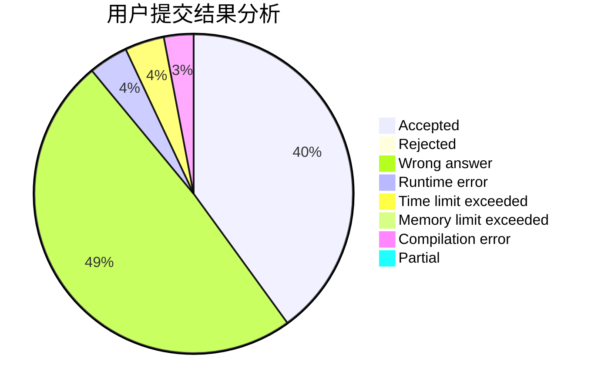
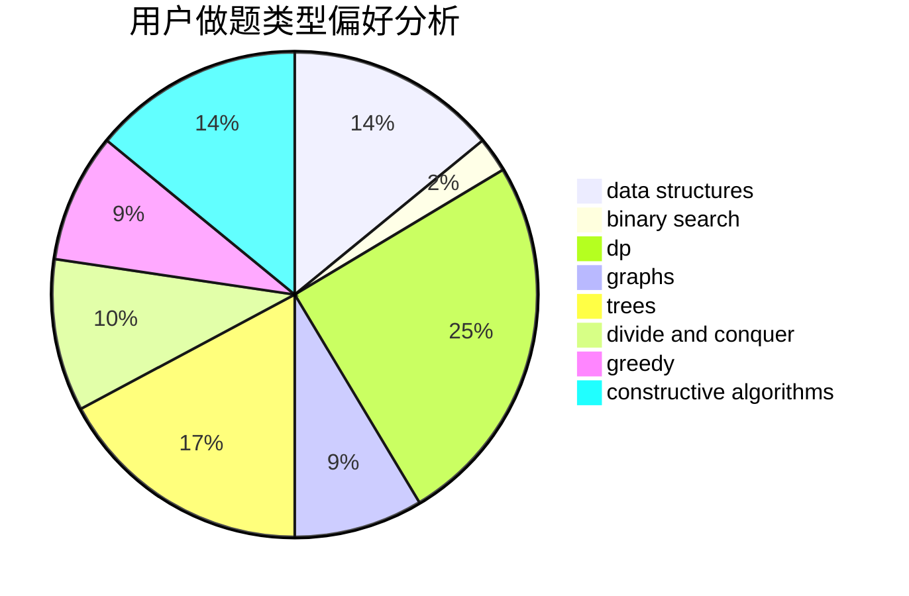

# znmsmg

<!-- tabs:start -->

#### **用户提交结果分析**

#### **用户做题类型偏好分析**

#### **用户错题知识点分析**

<!-- tabs:end -->
# 推荐题目
[14802](https://codeforces.com/contest/1480/problem/2)		dsu,graphs,sortings,trees		  
[1155A](https://codeforces.com/contest/1155/problem/A)		implementation,
                        sortings,
                        strings		  
[351C](https://codeforces.com/contest/351/problem/C)		dp,
                        matrices		  
[798E](https://codeforces.com/contest/798/problem/E)		constructive algorithms,
                        data structures,
                        graphs,
                        sortings		  
[327A](https://codeforces.com/contest/327/problem/A)		brute force,
                        dp,
                        implementation		  
[767A](https://codeforces.com/contest/767/problem/A)		data structures,
                        implementation		  
[1252L](https://codeforces.com/contest/1252/problem/L)		flows,
                        graphs		  
[277E](https://codeforces.com/contest/277/problem/E)		flows,
                        trees		  
[1132E](https://codeforces.com/contest/1132/problem/E)		dfs and similar,
                        dp,
                        greedy		  
[634D](https://codeforces.com/contest/634/problem/D)		dsu,graphs,sortings,trees		  
