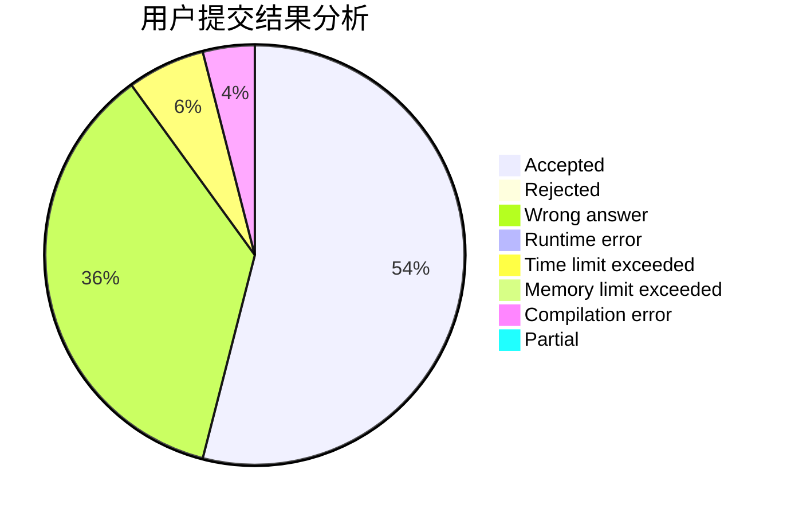
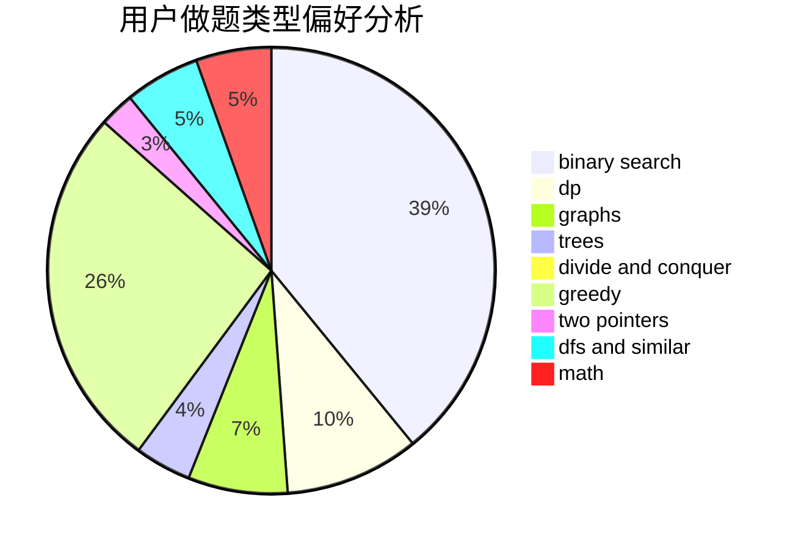

# Chestnut

<!-- tabs:start -->

#### **用户提交结果分析**

#### **用户做题类型偏好分析**

<!-- tabs:end -->
# 推荐题目
[1447A](https://codeforces.com/contest/1447/problem/A)
[705B](https://codeforces.com/contest/705/problem/B)
[706A](https://codeforces.com/contest/706/problem/A)
[1040B](https://codeforces.com/contest/1040/problem/B)
[319A](https://codeforces.com/contest/319/problem/A)
[271E](https://codeforces.com/contest/271/problem/E)
[704E](https://codeforces.com/contest/704/problem/E)
[136C](https://codeforces.com/contest/136/problem/C)
[1194D](https://codeforces.com/contest/1194/problem/D)
[1280A](https://codeforces.com/contest/1280/problem/A)
