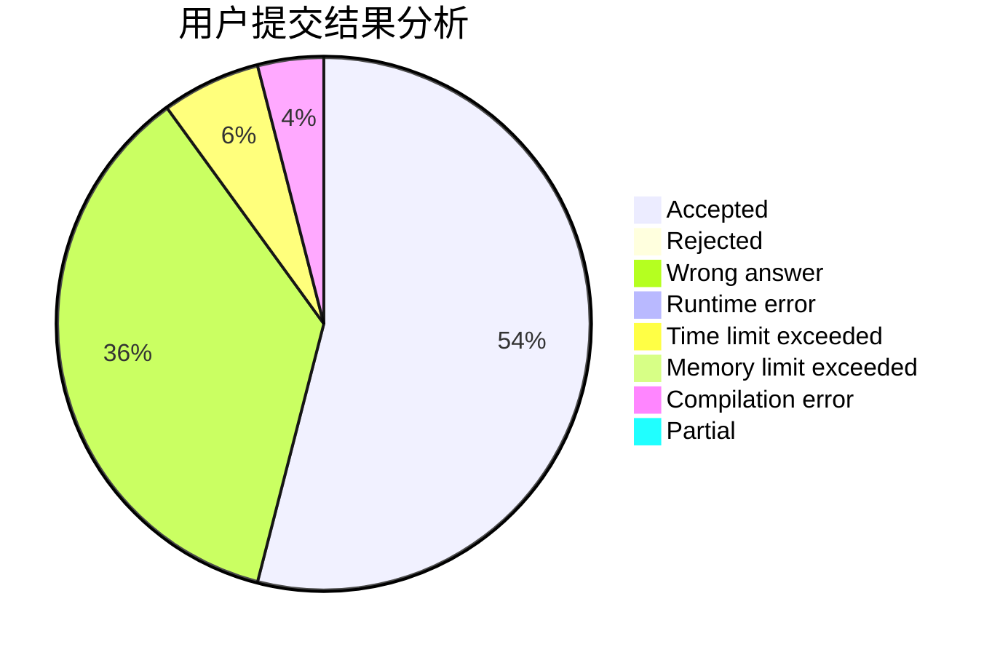
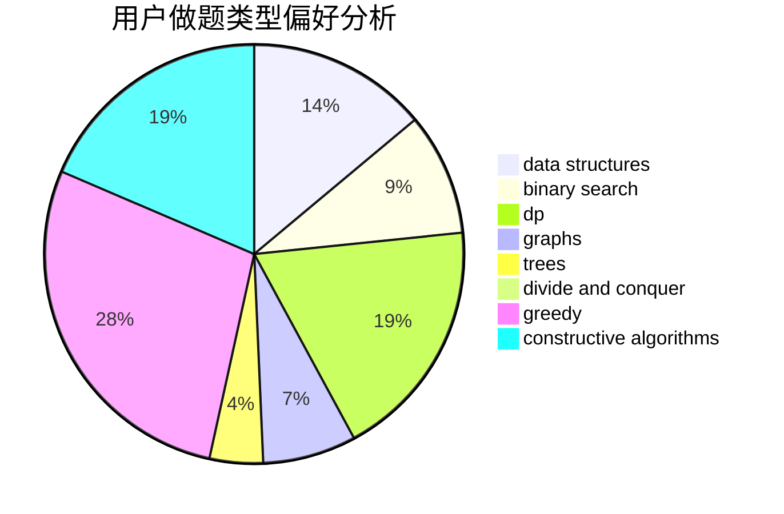
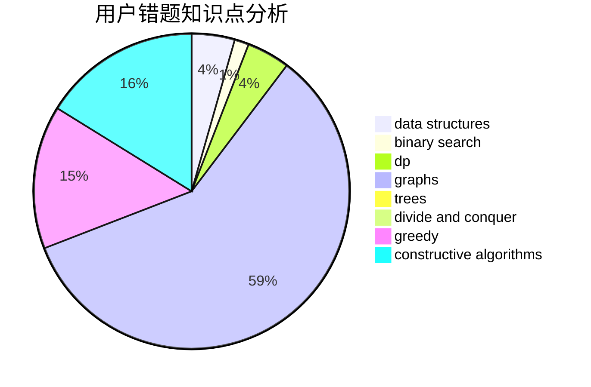

# Chestnut

<!-- tabs:start -->

#### **用户提交结果分析**

#### **用户做题类型偏好分析**

#### **用户错题知识点分析**

<!-- tabs:end -->
# 推荐题目
[1437D](https://codeforces.com/contest/1437/problem/D)		graphs,
                        greedy,
                        shortest paths,
                        trees		  
[681C](https://codeforces.com/contest/681/problem/C)		constructive algorithms,
                        data structures,
                        greedy		  
[682A](https://codeforces.com/contest/682/problem/A)		constructive algorithms,
                        math,
                        number theory		  
[103D](https://codeforces.com/contest/103/problem/D)		brute force,
                        data structures,
                        sortings		  
[300C](https://codeforces.com/contest/300/problem/C)		brute force,
                        combinatorics		  
[254A](https://codeforces.com/contest/254/problem/A)		constructive algorithms,
                        sortings		  
[681A](https://codeforces.com/contest/681/problem/A)		implementation		  
[1362D](https://codeforces.com/contest/1362/problem/D)		dsu,graphs,sortings,trees		  
[1189B](https://codeforces.com/contest/1189/problem/B)		greedy,
                        math,
                        sortings		  
[1270H](https://codeforces.com/contest/1270/problem/H)		data structures		  
