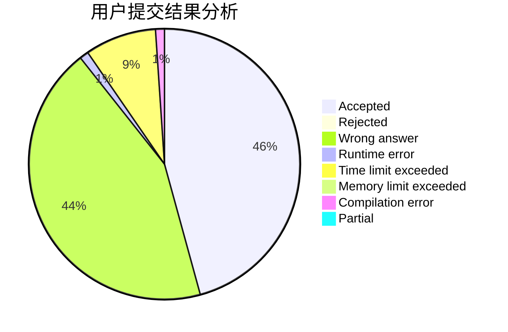
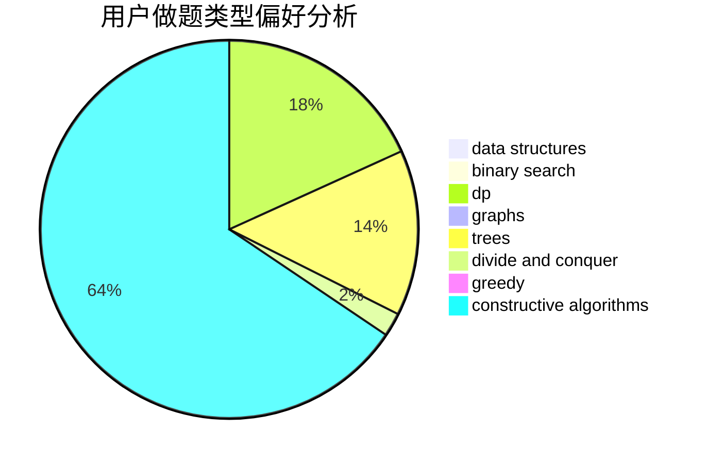
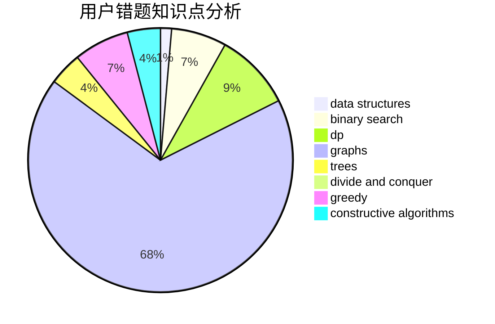

# znstz_qaq

<!-- tabs:start -->

#### **用户提交结果分析**

#### **用户做题类型偏好分析**

#### **用户错题知识点分析**

<!-- tabs:end -->
# 推荐题目
[467A](https://codeforces.com/contest/467/problem/A)		implementation		  
[12471](https://codeforces.com/contest/1247/problem/1)		dsu,graphs,sortings,trees		  
[1267I](https://codeforces.com/contest/1267/problem/I)		brute force,
                        constructive algorithms,
                        implementation,
                        interactive,
                        sortings		  
[949E](https://codeforces.com/contest/949/problem/E)		brute force		  
[846A](https://codeforces.com/contest/846/problem/A)		brute force,
                        implementation		  
[1004B](https://codeforces.com/contest/1004/problem/B)		constructive algorithms,
                        greedy,
                        implementation,
                        math		  
[1294F](https://codeforces.com/contest/1294/problem/F)		dfs and similar,
                        dp,
                        greedy,
                        trees		  
[1218H](https://codeforces.com/contest/1218/problem/H)		dfs and similar		  
[990A](https://codeforces.com/contest/990/problem/A)		implementation,
                        math		  
[610B](https://codeforces.com/contest/610/problem/B)		constructive algorithms,
                        implementation		  
