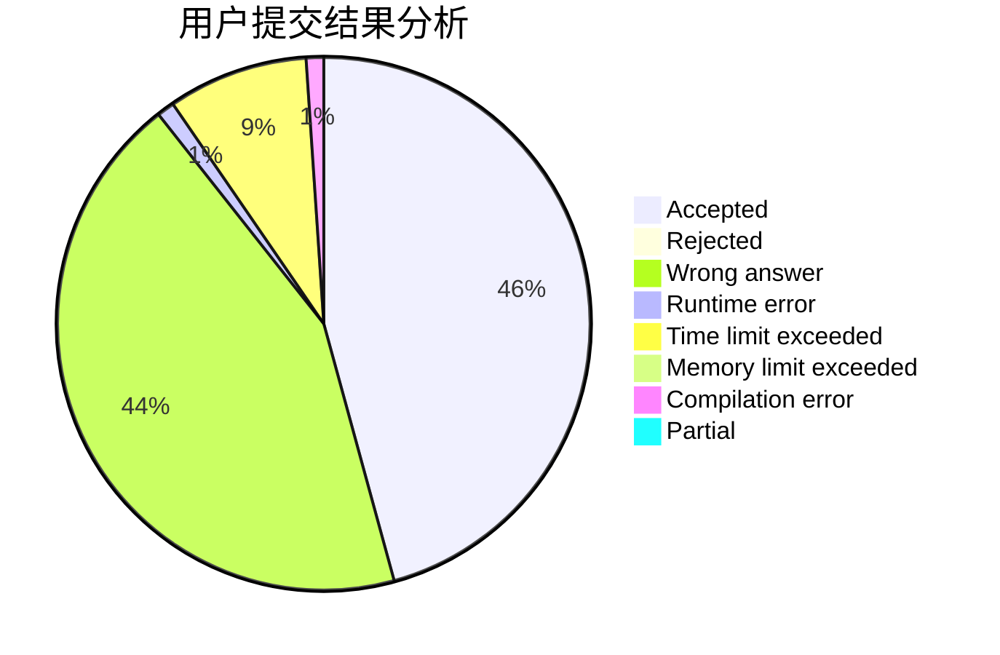
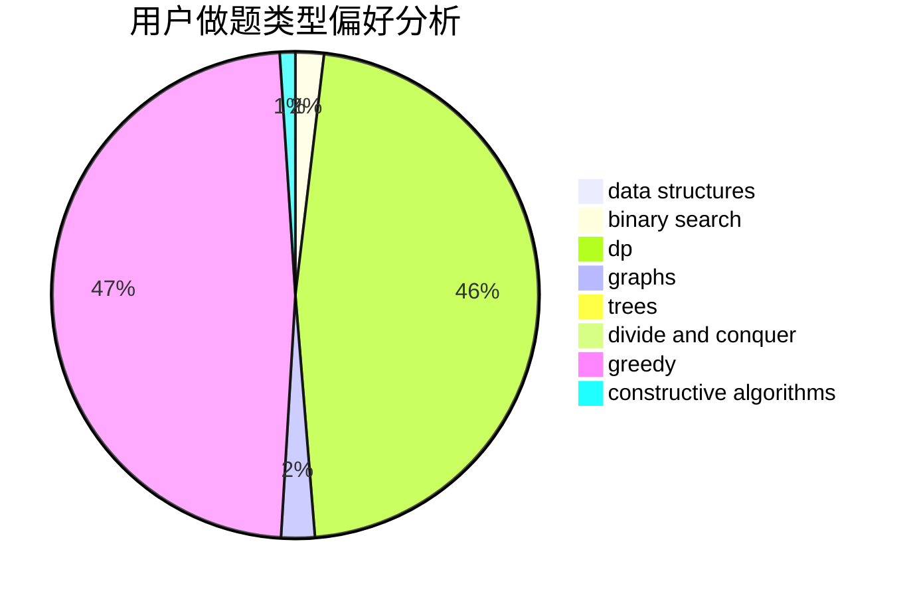
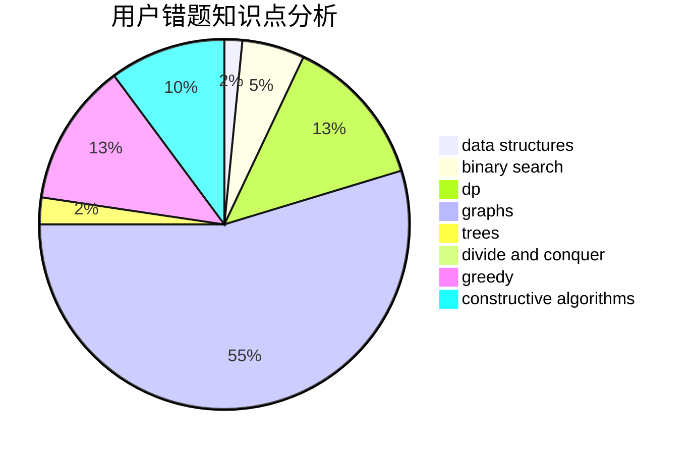

# znstz_qaq

<!-- tabs:start -->

#### **用户提交结果分析**

#### **用户做题类型偏好分析**

#### **用户错题知识点分析**

<!-- tabs:end -->
# 推荐题目
[446E](https://codeforces.com/contest/446/problem/E)		math,
                        matrices		  
[1241C](https://codeforces.com/contest/1241/problem/C)		dsu,graphs,sortings,trees		  
[1262A](https://codeforces.com/contest/1262/problem/A)		dsu,graphs,sortings,trees		  
[928B](https://codeforces.com/contest/928/problem/B)		*special problem,
                        dp		  
[827E](https://codeforces.com/contest/827/problem/E)		fft,
                        math,
                        strings		  
[1003E](https://codeforces.com/contest/1003/problem/E)		constructive algorithms,
                        graphs		  
[1287C](https://codeforces.com/contest/1287/problem/C)		dsu,graphs,sortings,trees		  
[1213E](https://codeforces.com/contest/1213/problem/E)		brute force,
                        constructive algorithms		  
[976B](https://codeforces.com/contest/976/problem/B)		implementation,
                        math		  
[590D](https://codeforces.com/contest/590/problem/D)		dp		  
