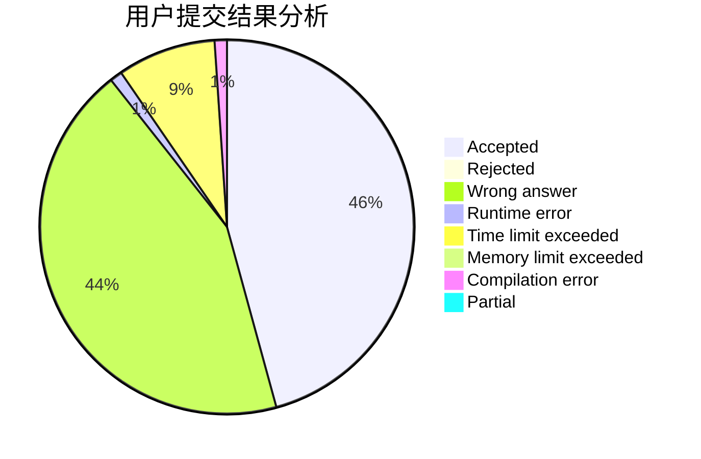
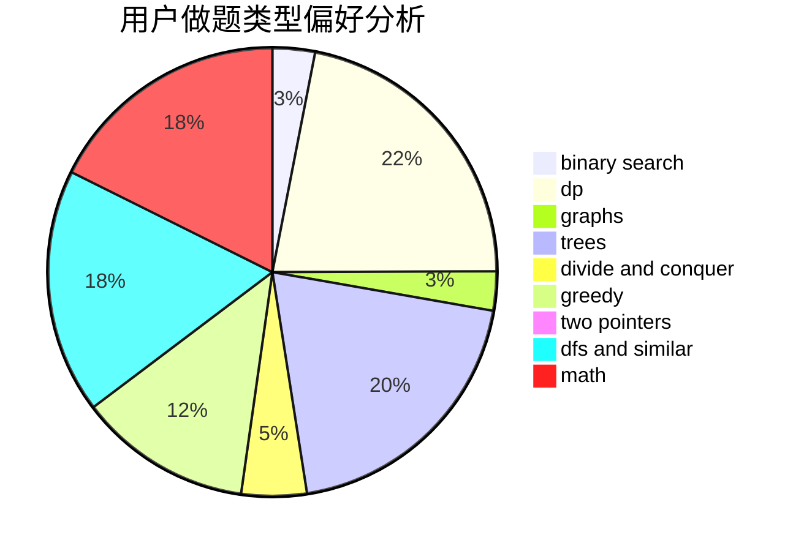

# znstz_qaq

<!-- tabs:start -->

#### **用户提交结果分析**

#### **用户做题类型偏好分析**

<!-- tabs:end -->
# 推荐题目
[467A](https://codeforces.com/contest/467/problem/A)
[12471](https://codeforces.com/contest/1247/problem/1)
[1267I](https://codeforces.com/contest/1267/problem/I)
[949E](https://codeforces.com/contest/949/problem/E)
[846A](https://codeforces.com/contest/846/problem/A)
[1004B](https://codeforces.com/contest/1004/problem/B)
[1294F](https://codeforces.com/contest/1294/problem/F)
[1218H](https://codeforces.com/contest/1218/problem/H)
[990A](https://codeforces.com/contest/990/problem/A)
[610B](https://codeforces.com/contest/610/problem/B)
