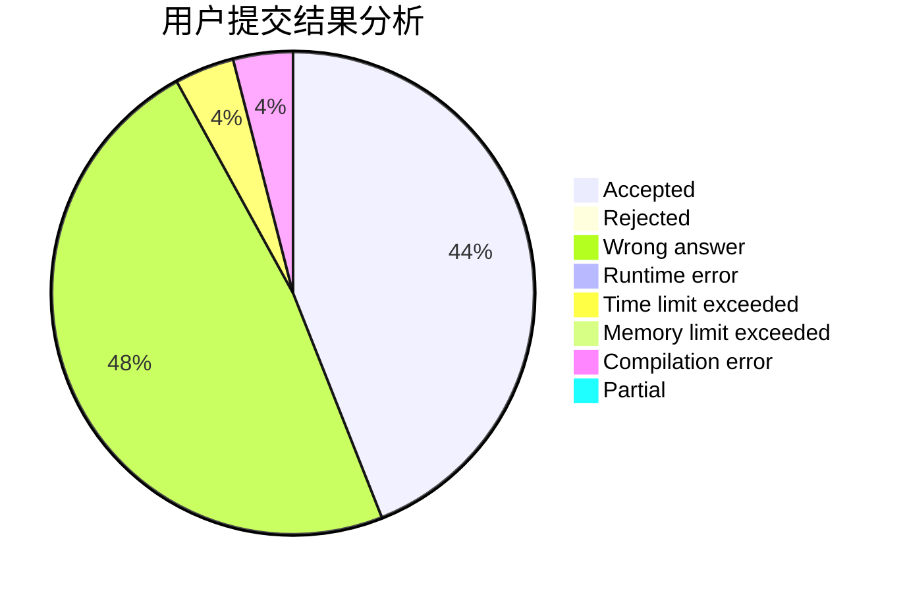
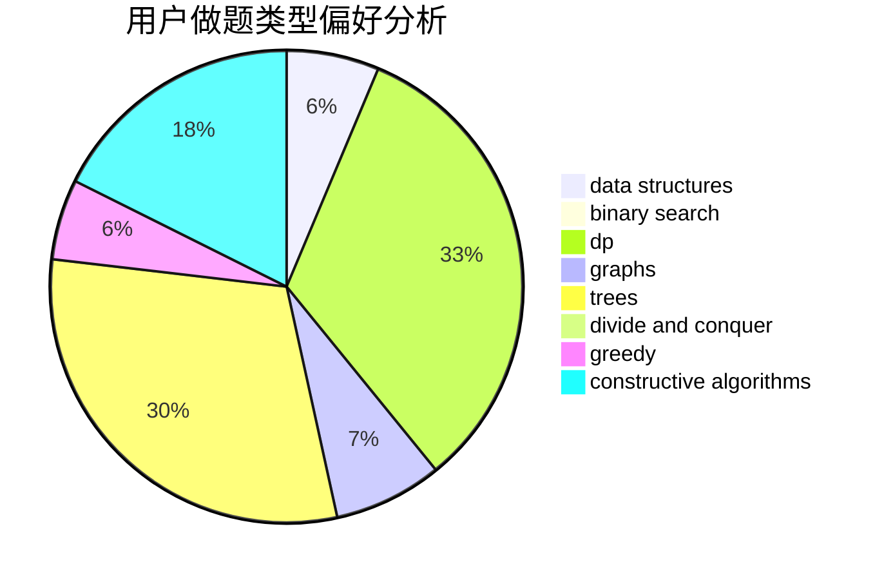
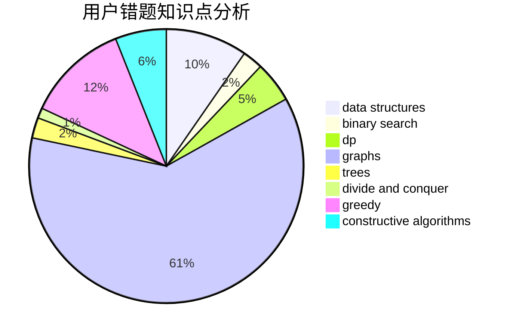

# zombie462

<!-- tabs:start -->

#### **用户提交结果分析**

#### **用户做题类型偏好分析**

#### **用户错题知识点分析**

<!-- tabs:end -->
# 推荐题目
[721E](https://codeforces.com/contest/721/problem/E)		binary search,
                        dp		  
[852D](https://codeforces.com/contest/852/problem/D)		binary search,
                        flows,
                        graph matchings,
                        shortest paths		  
[938E](https://codeforces.com/contest/938/problem/E)		combinatorics,
                        math		  
[215E](https://codeforces.com/contest/215/problem/E)		combinatorics,
                        dp,
                        number theory		  
[1334G](https://codeforces.com/contest/1334/problem/G)		bitmasks,
                        brute force,
                        fft		  
[645F](https://codeforces.com/contest/645/problem/F)		combinatorics,
                        math,
                        number theory		  
[32B](https://codeforces.com/contest/32/problem/B)		expression parsing,
                        implementation		  
[3C](https://codeforces.com/contest/3/problem/C)		brute force,
                        games,
                        implementation		  
[820C](https://codeforces.com/contest/820/problem/C)		dsu,graphs,sortings,trees		  
[29B](https://codeforces.com/contest/29/problem/B)		implementation		  
