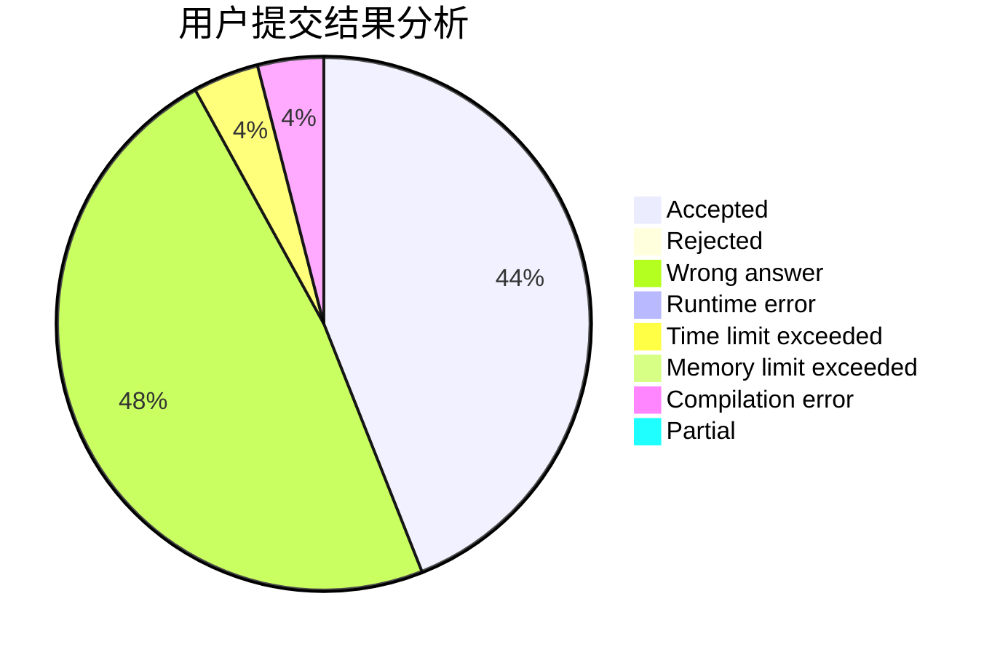
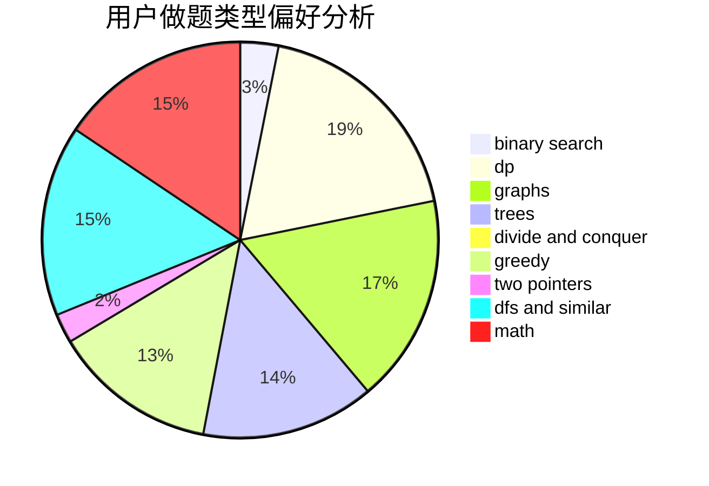

# zombie462

<!-- tabs:start -->

#### **用户提交结果分析**

#### **用户做题类型偏好分析**

<!-- tabs:end -->
# 推荐题目
[721E](https://codeforces.com/contest/721/problem/E)
[852D](https://codeforces.com/contest/852/problem/D)
[938E](https://codeforces.com/contest/938/problem/E)
[215E](https://codeforces.com/contest/215/problem/E)
[1334G](https://codeforces.com/contest/1334/problem/G)
[645F](https://codeforces.com/contest/645/problem/F)
[32B](https://codeforces.com/contest/32/problem/B)
[3C](https://codeforces.com/contest/3/problem/C)
[820C](https://codeforces.com/contest/820/problem/C)
[29B](https://codeforces.com/contest/29/problem/B)
