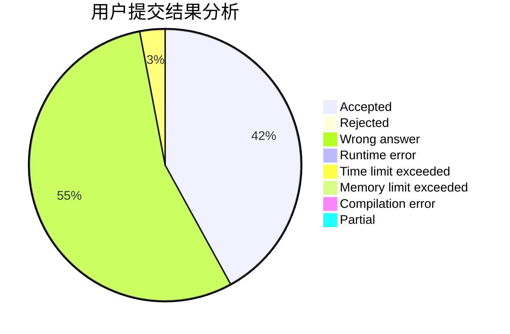
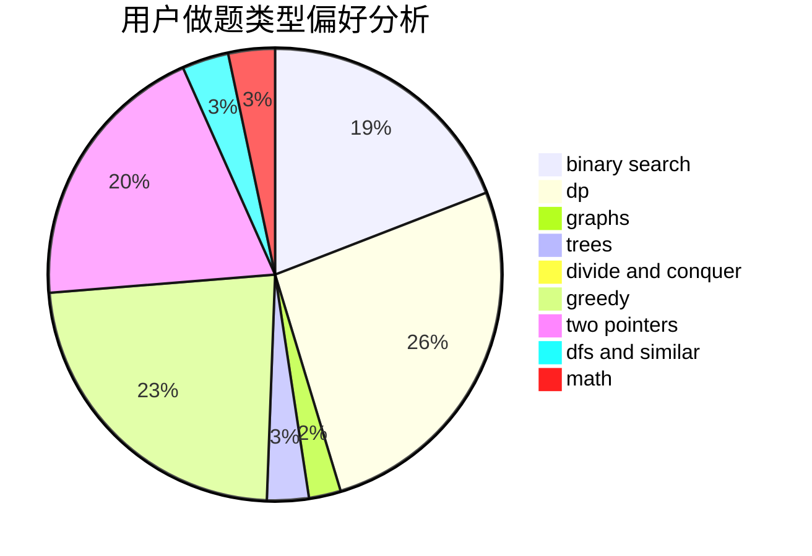

# zongzi

<!-- tabs:start -->

#### **用户提交结果分析**

#### **用户做题类型偏好分析**

<!-- tabs:end -->
# 推荐题目
[225E](https://codeforces.com/contest/225/problem/E)
[515A](https://codeforces.com/contest/515/problem/A)
[868D](https://codeforces.com/contest/868/problem/D)
[1331A](https://codeforces.com/contest/1331/problem/A)
[1220C](https://codeforces.com/contest/1220/problem/C)
[323C](https://codeforces.com/contest/323/problem/C)
[794G](https://codeforces.com/contest/794/problem/G)
[1245B](https://codeforces.com/contest/1245/problem/B)
[771C](https://codeforces.com/contest/771/problem/C)
[160D](https://codeforces.com/contest/160/problem/D)
