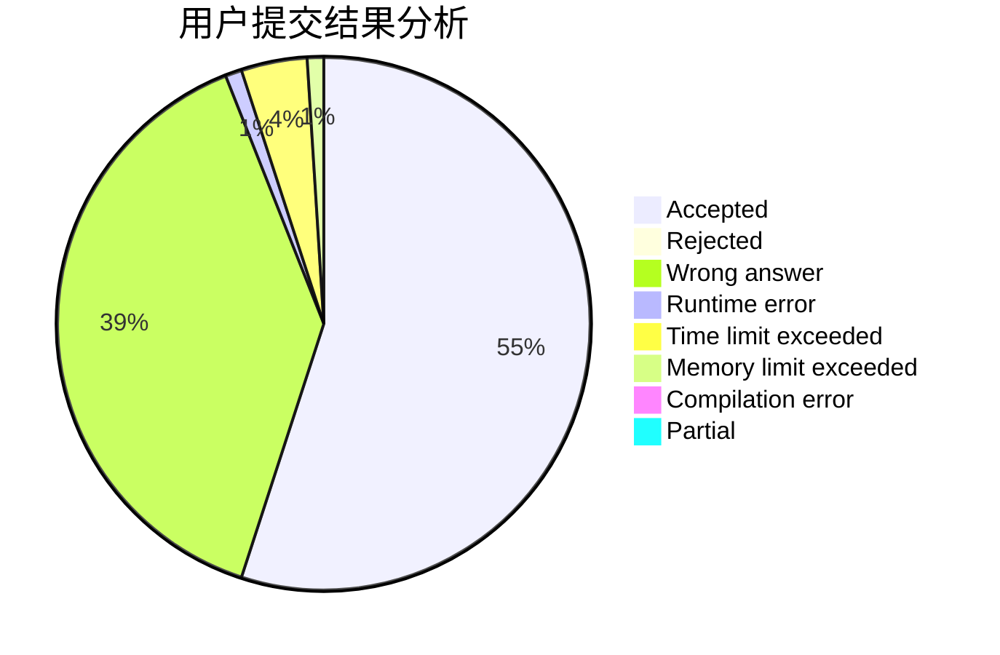
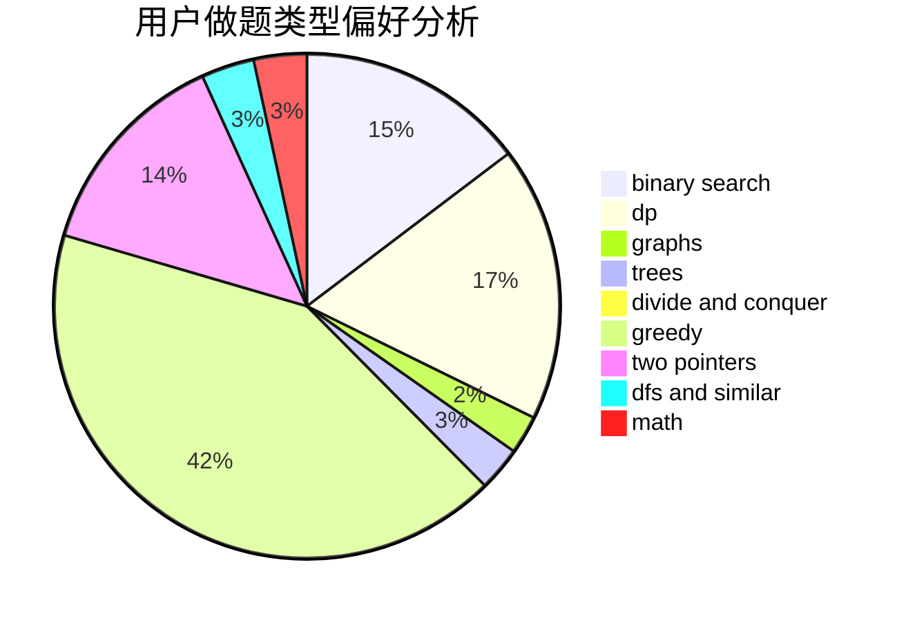

# zoutong

<!-- tabs:start -->

#### **用户提交结果分析**

#### **用户做题类型偏好分析**

<!-- tabs:end -->
# 推荐题目
[768G](https://codeforces.com/contest/768/problem/G)
[1278D](https://codeforces.com/contest/1278/problem/D)
[176B](https://codeforces.com/contest/176/problem/B)
[1423I](https://codeforces.com/contest/1423/problem/I)
[383E](https://codeforces.com/contest/383/problem/E)
[1059A](https://codeforces.com/contest/1059/problem/A)
[1078C](https://codeforces.com/contest/1078/problem/C)
[627F](https://codeforces.com/contest/627/problem/F)
[1230D](https://codeforces.com/contest/1230/problem/D)
[215E](https://codeforces.com/contest/215/problem/E)
