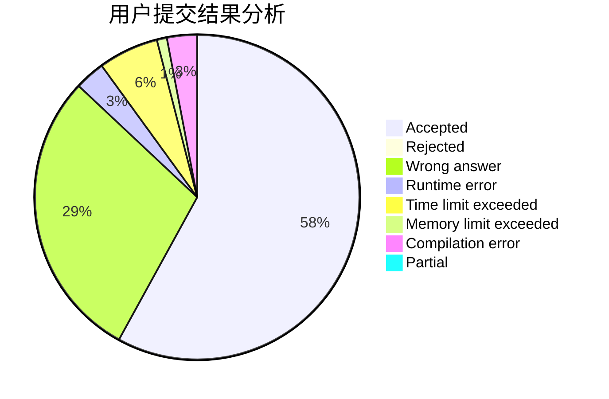
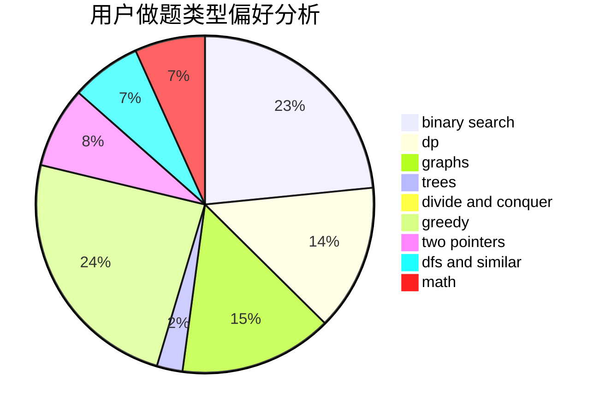

# zqy1018

<!-- tabs:start -->

#### **用户提交结果分析**

#### **用户做题类型偏好分析**

<!-- tabs:end -->
# 推荐题目
[388C](https://codeforces.com/contest/388/problem/C)
[861C](https://codeforces.com/contest/861/problem/C)
[497E](https://codeforces.com/contest/497/problem/E)
[1045C](https://codeforces.com/contest/1045/problem/C)
[1372F](https://codeforces.com/contest/1372/problem/F)
[1164I](https://codeforces.com/contest/1164/problem/I)
[608C](https://codeforces.com/contest/608/problem/C)
[922B](https://codeforces.com/contest/922/problem/B)
[434C](https://codeforces.com/contest/434/problem/C)
[460B](https://codeforces.com/contest/460/problem/B)
