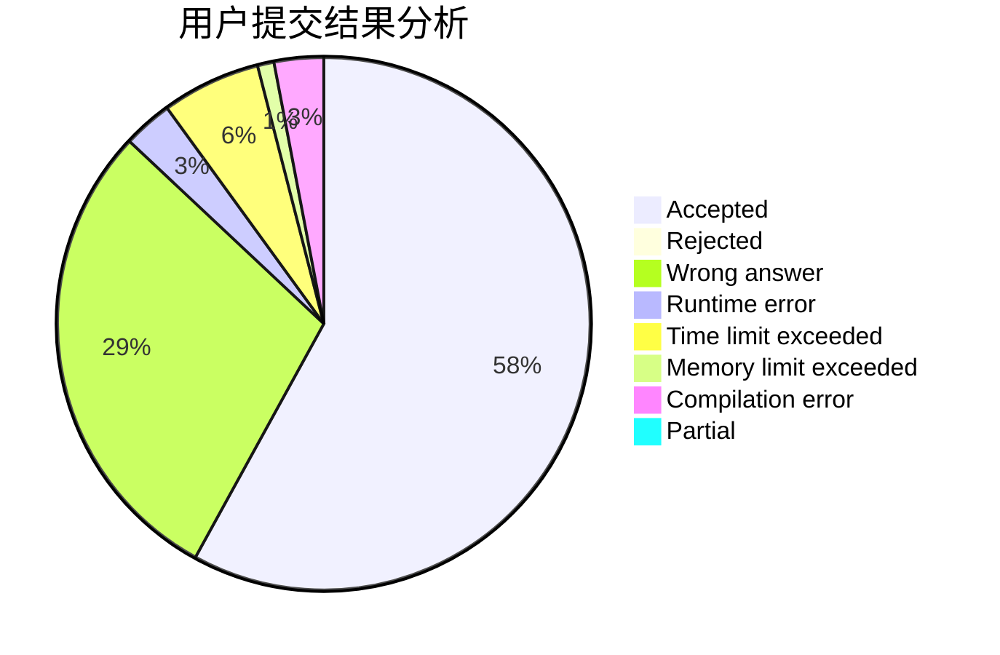
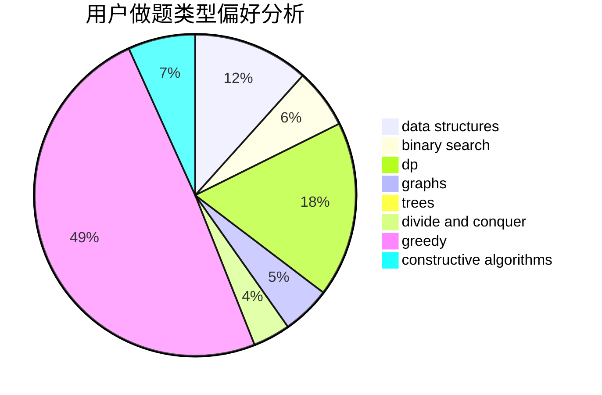
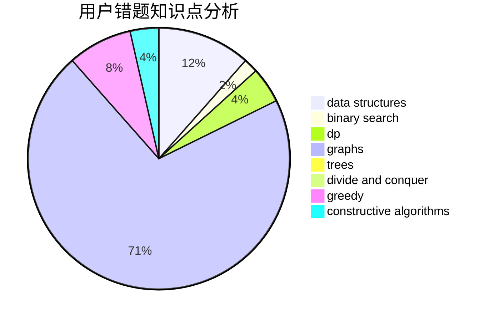

# zqy1018

<!-- tabs:start -->

#### **用户提交结果分析**

#### **用户做题类型偏好分析**

#### **用户错题知识点分析**

<!-- tabs:end -->
# 推荐题目
[360B](https://codeforces.com/contest/360/problem/B)		binary search,
                        dp		  
[842D](https://codeforces.com/contest/842/problem/D)		binary search,
                        data structures		  
[477E](https://codeforces.com/contest/477/problem/E)		data structures		  
[1044B](https://codeforces.com/contest/1044/problem/B)		dfs and similar,
                        interactive,
                        trees		  
[1366A](https://codeforces.com/contest/1366/problem/A)		binary search,
                        greedy,
                        math		  
[1162B](https://codeforces.com/contest/1162/problem/B)		brute force,
                        greedy		  
[588A](https://codeforces.com/contest/588/problem/A)		greedy		  
[908A](https://codeforces.com/contest/908/problem/A)		brute force,
                        implementation		  
[405C](https://codeforces.com/contest/405/problem/C)		implementation,
                        math		  
[438D](https://codeforces.com/contest/438/problem/D)		data structures,
                        math		  
