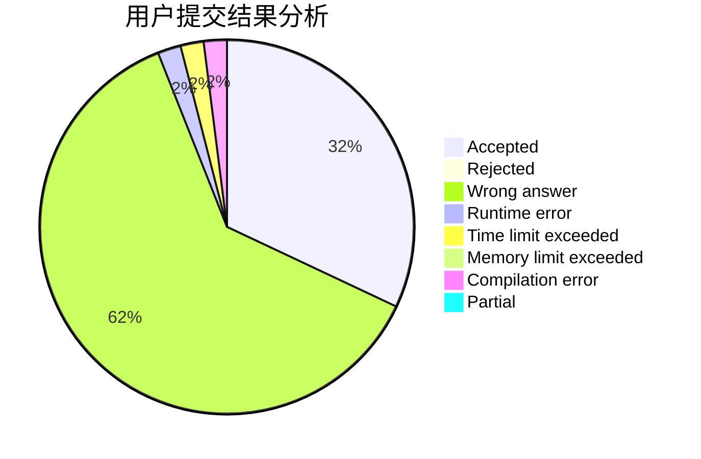
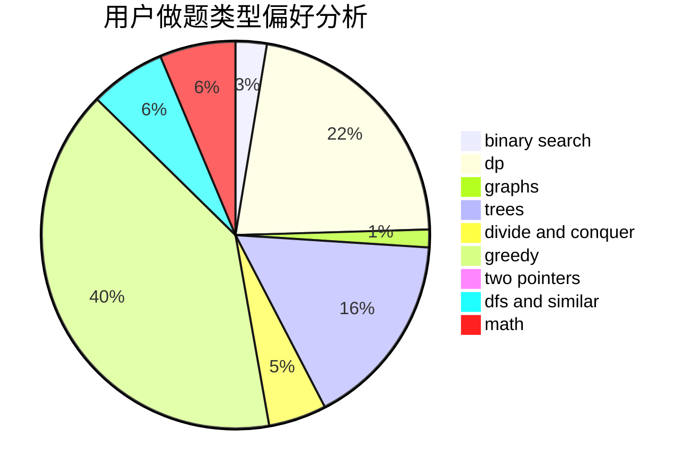

# zrzring

<!-- tabs:start -->

#### **用户提交结果分析**

#### **用户做题类型偏好分析**

<!-- tabs:end -->
# 推荐题目
[453B](https://codeforces.com/contest/453/problem/B)
[1076F](https://codeforces.com/contest/1076/problem/F)
[1065F](https://codeforces.com/contest/1065/problem/F)
[675D](https://codeforces.com/contest/675/problem/D)
[594E](https://codeforces.com/contest/594/problem/E)
[409G](https://codeforces.com/contest/409/problem/G)
[733D](https://codeforces.com/contest/733/problem/D)
[294E](https://codeforces.com/contest/294/problem/E)
[85D](https://codeforces.com/contest/85/problem/D)
[1165B](https://codeforces.com/contest/1165/problem/B)
