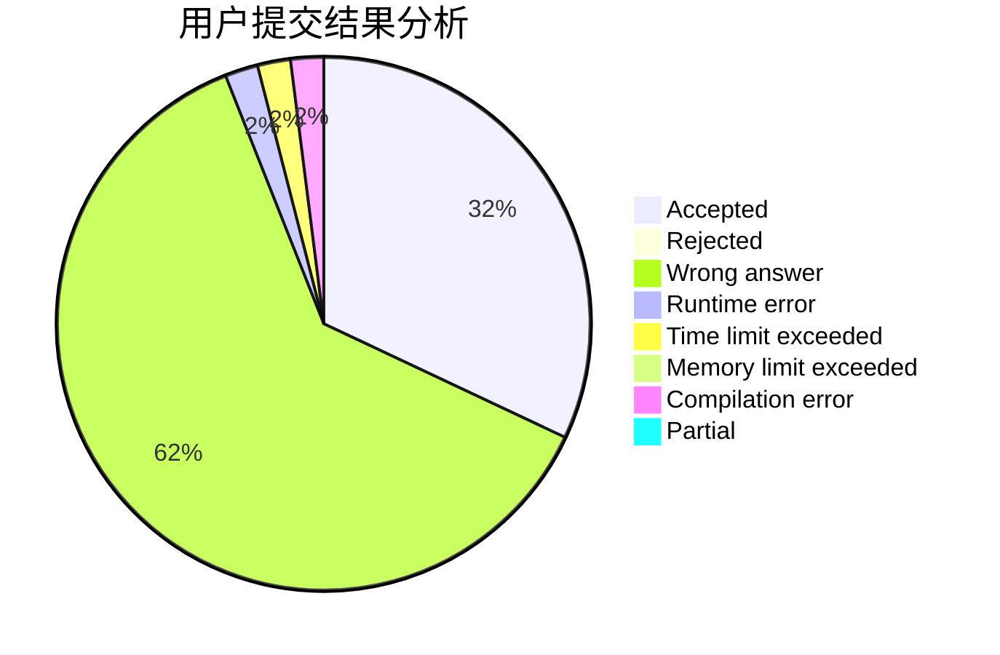
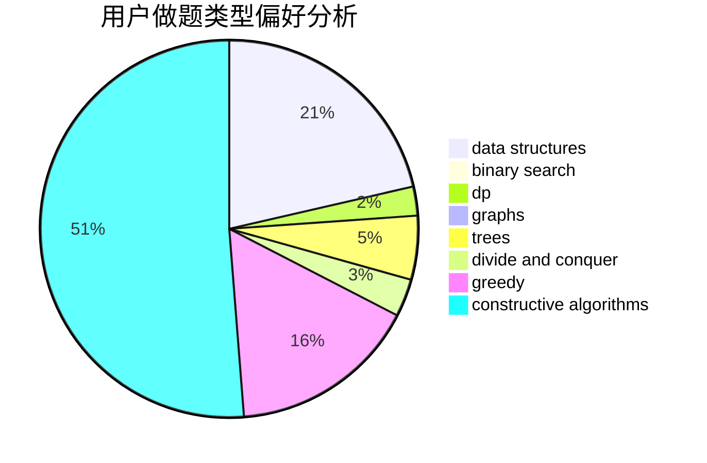
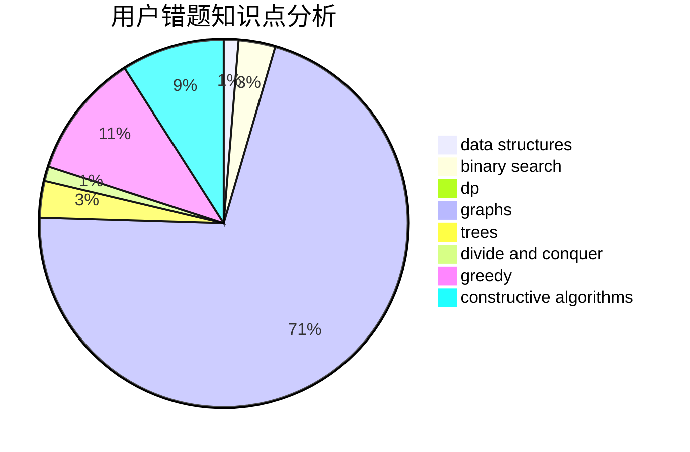

# zrzring

<!-- tabs:start -->

#### **用户提交结果分析**

#### **用户做题类型偏好分析**

#### **用户错题知识点分析**

<!-- tabs:end -->
# 推荐题目
[453B](https://codeforces.com/contest/453/problem/B)		bitmasks,
                        brute force,
                        dp		  
[1076F](https://codeforces.com/contest/1076/problem/F)		dp,
                        greedy		  
[1065F](https://codeforces.com/contest/1065/problem/F)		dfs and similar,
                        dp,
                        trees		  
[675D](https://codeforces.com/contest/675/problem/D)		data structures,
                        trees		  
[594E](https://codeforces.com/contest/594/problem/E)		string suffix structures,
                        strings		  
[409G](https://codeforces.com/contest/409/problem/G)		*special problem,
                        geometry		  
[733D](https://codeforces.com/contest/733/problem/D)		data structures,
                        hashing		  
[294E](https://codeforces.com/contest/294/problem/E)		dp,
                        trees		  
[85D](https://codeforces.com/contest/85/problem/D)		binary search,
                        brute force,
                        data structures,
                        implementation		  
[1165B](https://codeforces.com/contest/1165/problem/B)		data structures,
                        greedy,
                        sortings		  
