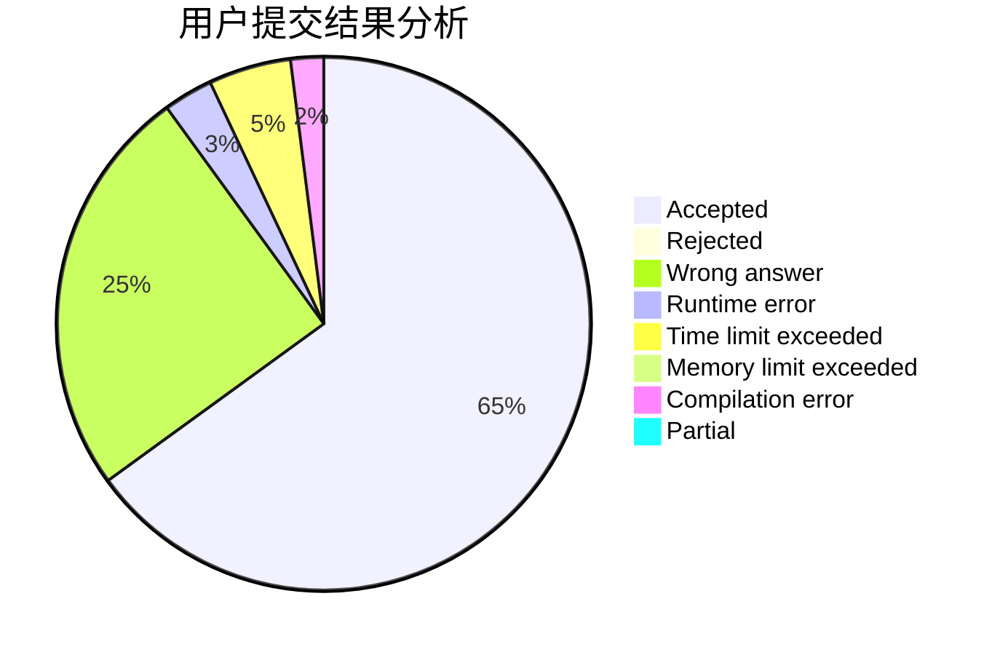
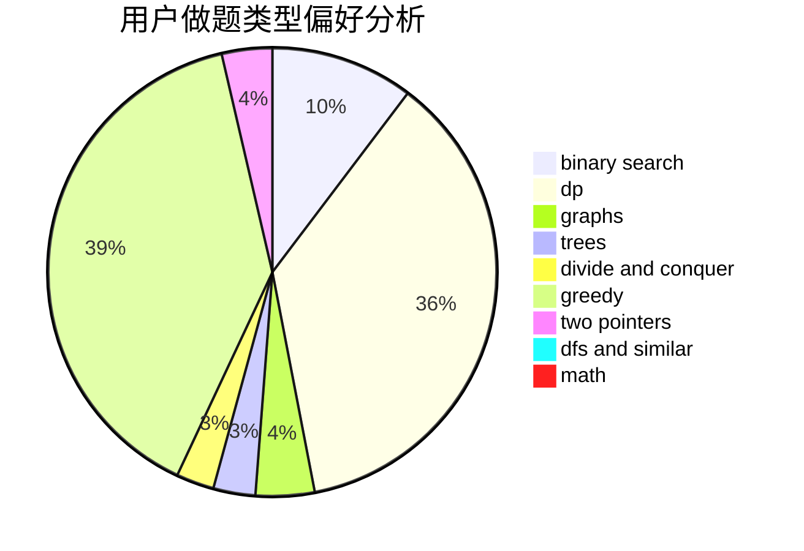

# zser

<!-- tabs:start -->

#### **用户提交结果分析**

#### **用户做题类型偏好分析**

<!-- tabs:end -->
# 推荐题目
[1280A](https://codeforces.com/contest/1280/problem/A)
[1142D](https://codeforces.com/contest/1142/problem/D)
[1164F](https://codeforces.com/contest/1164/problem/F)
[1471F](https://codeforces.com/contest/1471/problem/F)
[1468K](https://codeforces.com/contest/1468/problem/K)
[1415F](https://codeforces.com/contest/1415/problem/F)
[445C](https://codeforces.com/contest/445/problem/C)
[508E](https://codeforces.com/contest/508/problem/E)
[303E](https://codeforces.com/contest/303/problem/E)
[10021](https://codeforces.com/contest/1002/problem/1)
