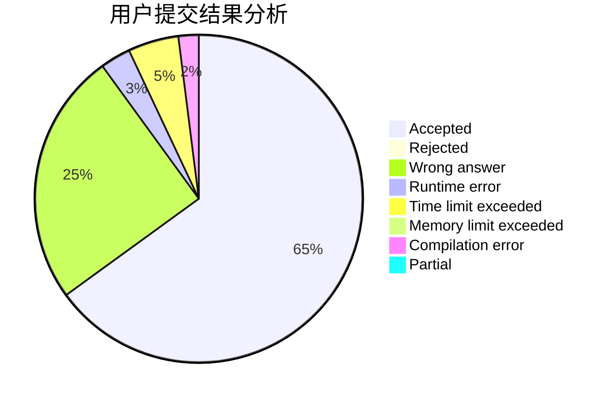
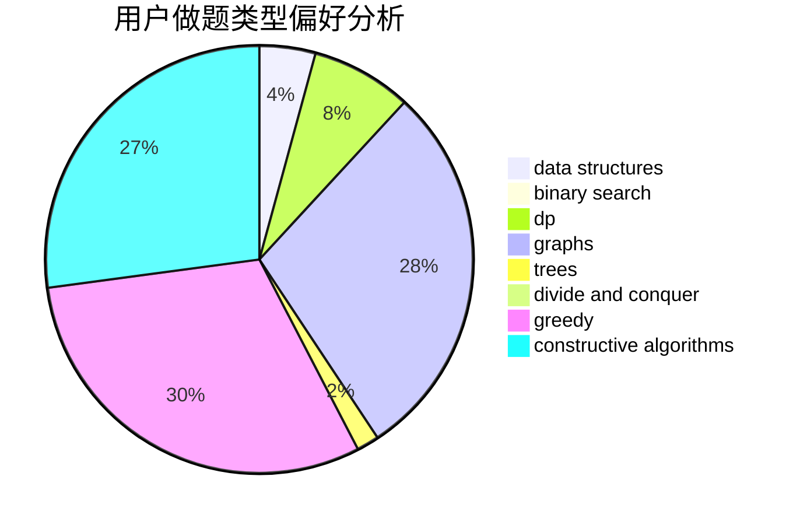

# zser

<!-- tabs:start -->

#### **用户提交结果分析**

#### **用户做题类型偏好分析**

#### **用户错题知识点分析**

<!-- tabs:end -->
# 推荐题目
[1270H](https://codeforces.com/contest/1270/problem/H)		data structures		  
[1140F](https://codeforces.com/contest/1140/problem/F)		data structures,
                        divide and conquer,
                        dsu		  
[1161D](https://codeforces.com/contest/1161/problem/D)		dsu,graphs,sortings,trees		  
[1464E](https://codeforces.com/contest/1464/problem/E)		dsu,graphs,sortings,trees		  
[1461A](https://codeforces.com/contest/1461/problem/A)		constructive algorithms,
                        greedy		  
[1404D](https://codeforces.com/contest/1404/problem/D)		constructive algorithms,
                        dfs and similar,
                        interactive,
                        math,
                        number theory		  
[41E](https://codeforces.com/contest/41/problem/E)		constructive algorithms,
                        graphs,
                        greedy		  
[488B](https://codeforces.com/contest/488/problem/B)		brute force,
                        constructive algorithms,
                        math		  
[28A](https://codeforces.com/contest/28/problem/A)		implementation		  
[1002A1](https://codeforces.com/contest/1002A/problem/1)		nan		  
