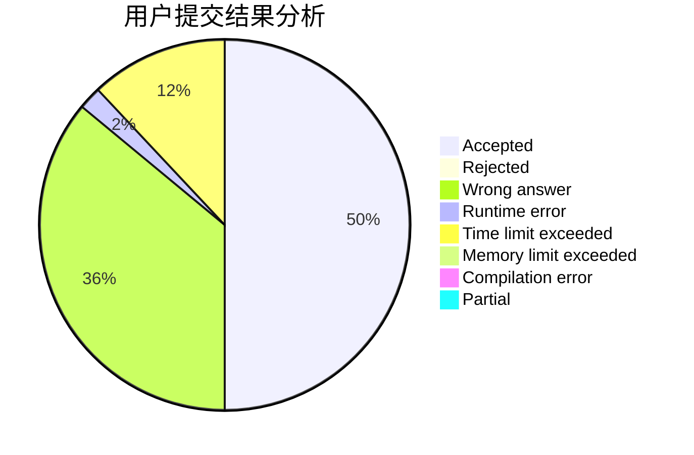
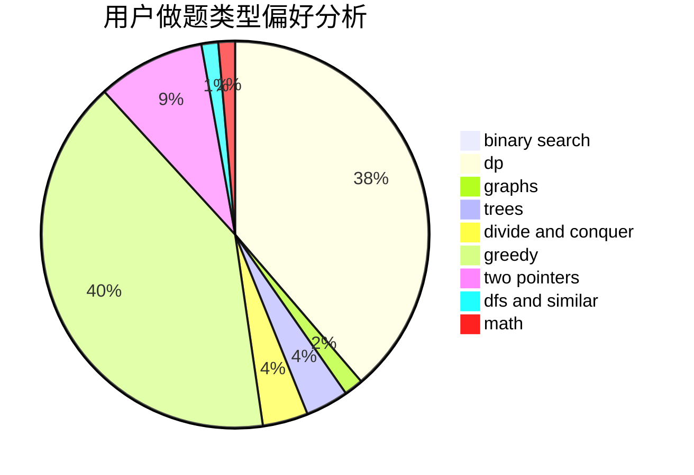

# zswzswzswzsw

<!-- tabs:start -->

#### **用户提交结果分析**

#### **用户做题类型偏好分析**

<!-- tabs:end -->
# 推荐题目
[1435E](https://codeforces.com/contest/1435/problem/E)
[1431D](https://codeforces.com/contest/1431/problem/D)
[582A](https://codeforces.com/contest/582/problem/A)
[966C](https://codeforces.com/contest/966/problem/C)
[902B](https://codeforces.com/contest/902/problem/B)
[220B](https://codeforces.com/contest/220/problem/B)
[723B](https://codeforces.com/contest/723/problem/B)
[1176C](https://codeforces.com/contest/1176/problem/C)
[1155D](https://codeforces.com/contest/1155/problem/D)
[266C](https://codeforces.com/contest/266/problem/C)
