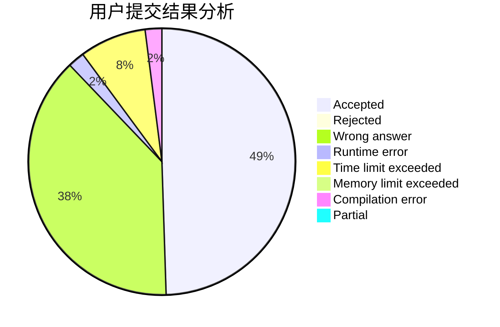
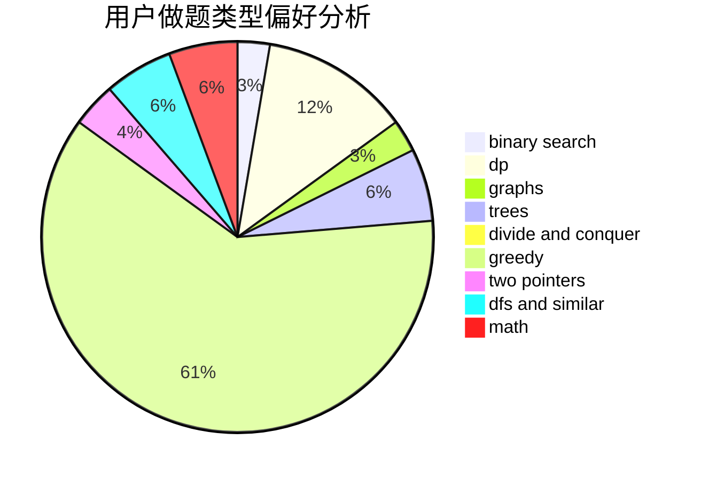

# zsz12251665

<!-- tabs:start -->

#### **用户提交结果分析**

#### **用户做题类型偏好分析**

<!-- tabs:end -->
# 推荐题目
[414B](https://codeforces.com/contest/414/problem/B)
[1070L](https://codeforces.com/contest/1070/problem/L)
[1307F](https://codeforces.com/contest/1307/problem/F)
[513C](https://codeforces.com/contest/513/problem/C)
[444E](https://codeforces.com/contest/444/problem/E)
[1250J](https://codeforces.com/contest/1250/problem/J)
[1037C](https://codeforces.com/contest/1037/problem/C)
[226B](https://codeforces.com/contest/226/problem/B)
[762D](https://codeforces.com/contest/762/problem/D)
[598D](https://codeforces.com/contest/598/problem/D)
