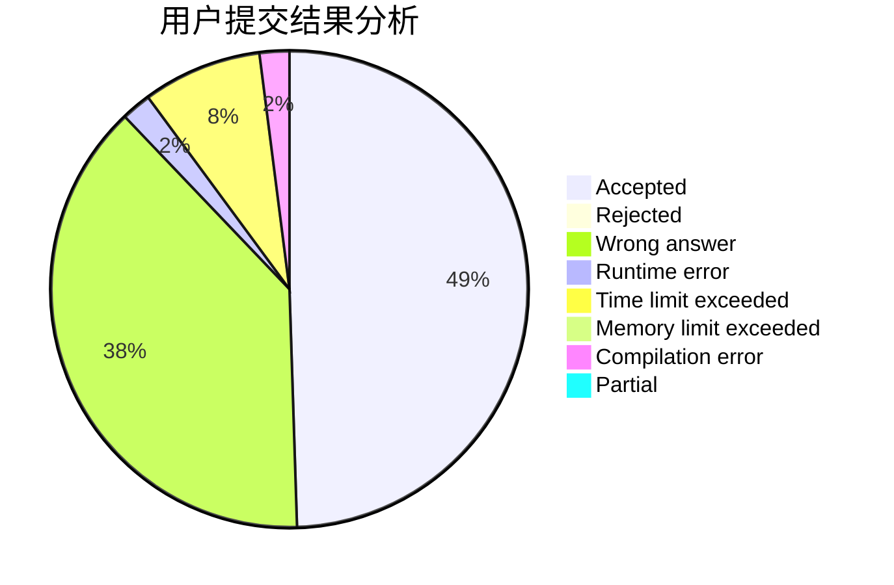
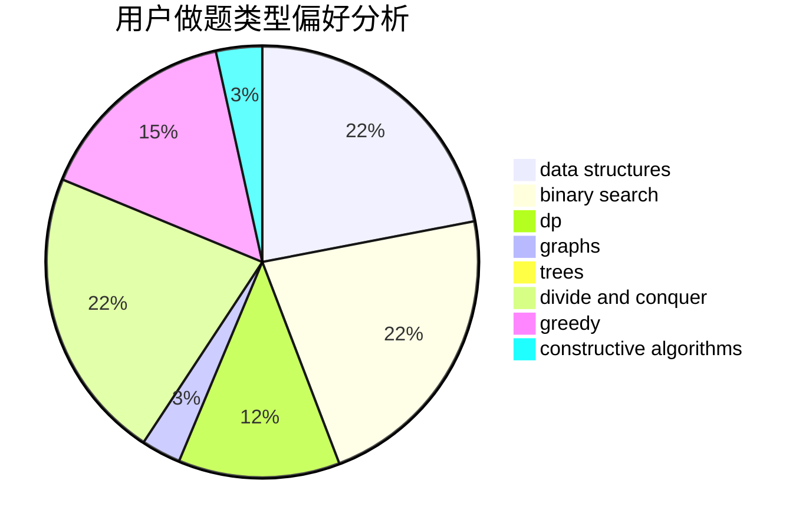

# zsz12251665

<!-- tabs:start -->

#### **用户提交结果分析**

#### **用户做题类型偏好分析**

#### **用户错题知识点分析**

<!-- tabs:end -->
# 推荐题目
[383A](https://codeforces.com/contest/383/problem/A)		data structures,
                        greedy		  
[1070I](https://codeforces.com/contest/1070/problem/I)		flows,
                        graph matchings,
                        graphs		  
[1300A](https://codeforces.com/contest/1300/problem/A)		implementation,
                        math		  
[493E](https://codeforces.com/contest/493/problem/E)		math		  
[41A](https://codeforces.com/contest/41/problem/A)		implementation,
                        strings		  
[1246B](https://codeforces.com/contest/1246/problem/B)		dsu,graphs,sortings,trees		  
[1036F](https://codeforces.com/contest/1036/problem/F)		combinatorics,
                        math,
                        number theory		  
[201C](https://codeforces.com/contest/201/problem/C)		dp		  
[741D](https://codeforces.com/contest/741/problem/D)		data structures,
                        dfs and similar,
                        trees		  
[576D](https://codeforces.com/contest/576/problem/D)		dp,
                        matrices		  
