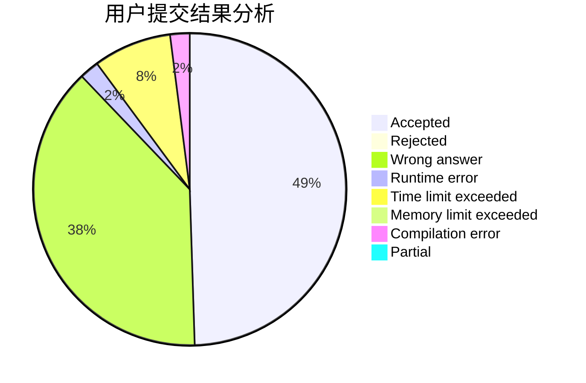
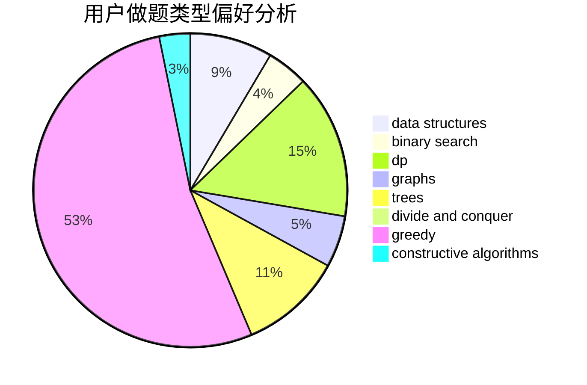

# zsz12251665

<!-- tabs:start -->

#### **用户提交结果分析**

#### **用户做题类型偏好分析**

#### **用户错题知识点分析**

<!-- tabs:end -->
# 推荐题目
[414B](https://codeforces.com/contest/414/problem/B)		combinatorics,
                        dp,
                        number theory		  
[1070L](https://codeforces.com/contest/1070/problem/L)		constructive algorithms		  
[1307F](https://codeforces.com/contest/1307/problem/F)		dfs and similar,
                        dsu,
                        trees		  
[513C](https://codeforces.com/contest/513/problem/C)		bitmasks,
                        probabilities		  
[444E](https://codeforces.com/contest/444/problem/E)		binary search,
                        dsu,
                        trees		  
[1250J](https://codeforces.com/contest/1250/problem/J)		binary search,
                        greedy		  
[1037C](https://codeforces.com/contest/1037/problem/C)		dp,
                        greedy,
                        strings		  
[226B](https://codeforces.com/contest/226/problem/B)		greedy		  
[762D](https://codeforces.com/contest/762/problem/D)		dp,
                        greedy,
                        implementation		  
[598D](https://codeforces.com/contest/598/problem/D)		dfs and similar,
                        graphs,
                        shortest paths		  
