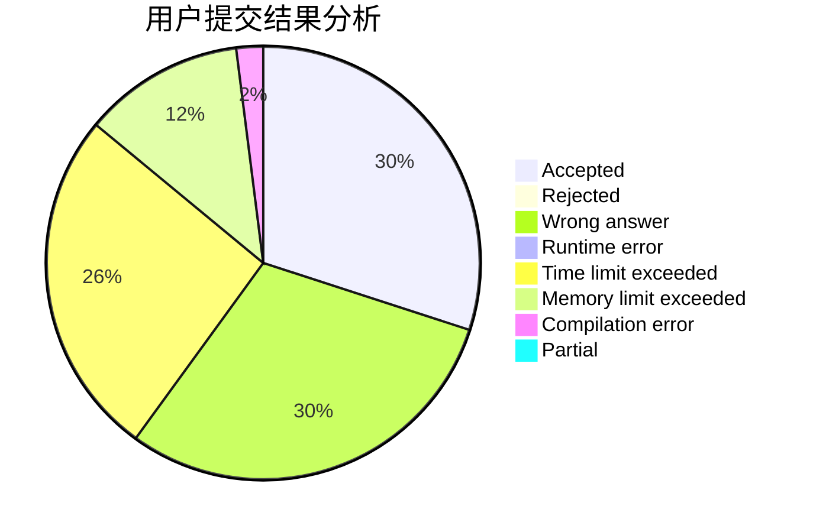
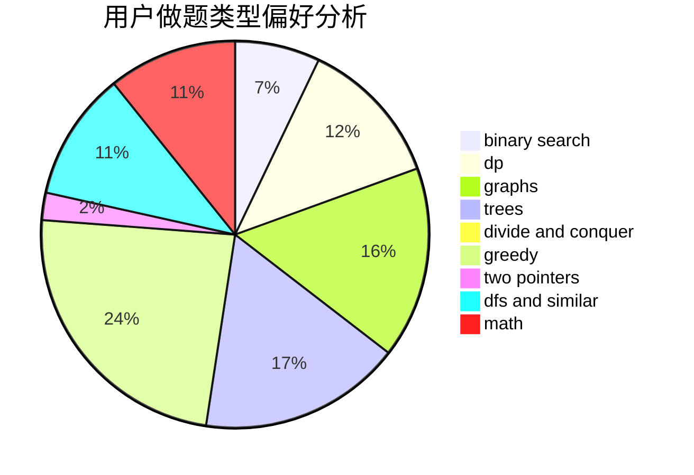

# zty_123

<!-- tabs:start -->

#### **用户提交结果分析**

#### **用户做题类型偏好分析**

<!-- tabs:end -->
# 推荐题目
[1009F](https://codeforces.com/contest/1009/problem/F)
[1374A](https://codeforces.com/contest/1374/problem/A)
[628B](https://codeforces.com/contest/628/problem/B)
[244C](https://codeforces.com/contest/244/problem/C)
[750D](https://codeforces.com/contest/750/problem/D)
[436B](https://codeforces.com/contest/436/problem/B)
[650B](https://codeforces.com/contest/650/problem/B)
[489A](https://codeforces.com/contest/489/problem/A)
[289E](https://codeforces.com/contest/289/problem/E)
[1367C](https://codeforces.com/contest/1367/problem/C)
