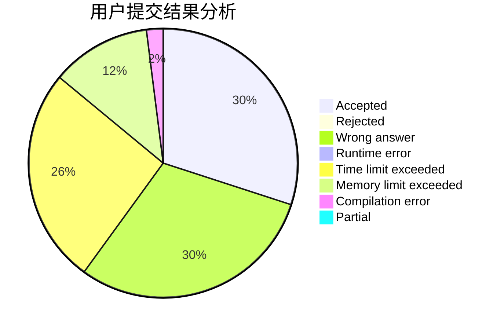
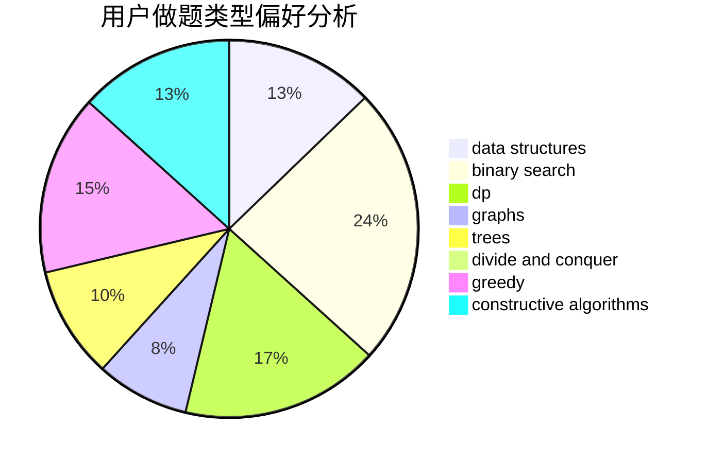

# zty_123

<!-- tabs:start -->

#### **用户提交结果分析**

#### **用户做题类型偏好分析**

#### **用户错题知识点分析**

<!-- tabs:end -->
# 推荐题目
[1009C](https://codeforces.com/contest/1009/problem/C)		greedy,
                        math		  
[1367D](https://codeforces.com/contest/1367/problem/D)		constructive algorithms,
                        greedy,
                        implementation,
                        sortings		  
[609B](https://codeforces.com/contest/609/problem/B)		constructive algorithms,
                        implementation		  
[225E](https://codeforces.com/contest/225/problem/E)		math,
                        number theory		  
[732E](https://codeforces.com/contest/732/problem/E)		greedy,
                        sortings		  
[407C](https://codeforces.com/contest/407/problem/C)		brute force,
                        combinatorics,
                        implementation,
                        math		  
[622B](https://codeforces.com/contest/622/problem/B)		implementation		  
[468E](https://codeforces.com/contest/468/problem/E)		dp,
                        graph matchings,
                        math,
                        meet-in-the-middle		  
[274A](https://codeforces.com/contest/274/problem/A)		binary search,
                        greedy,
                        sortings		  
[1359D](https://codeforces.com/contest/1359/problem/D)		data structures,
                        dp,
                        implementation,
                        two pointers		  
