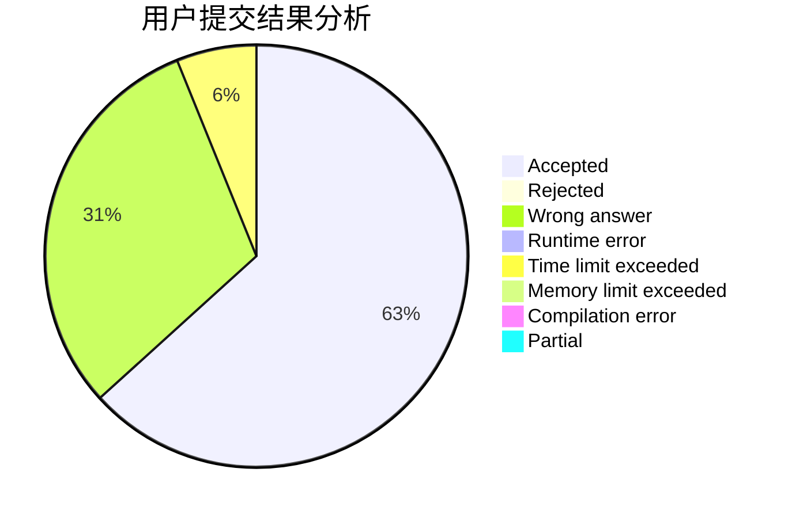
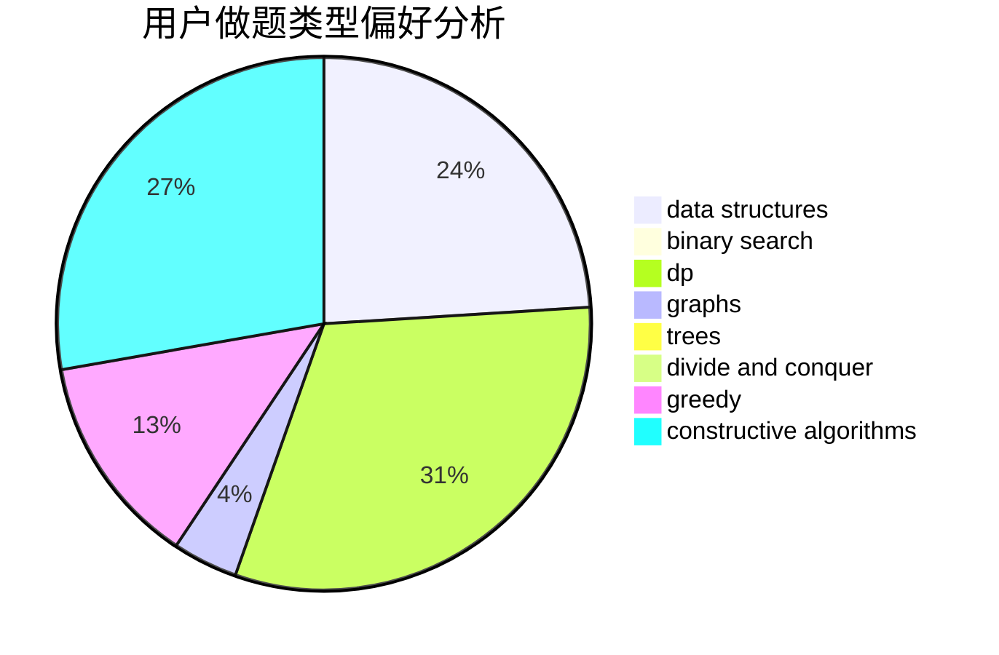
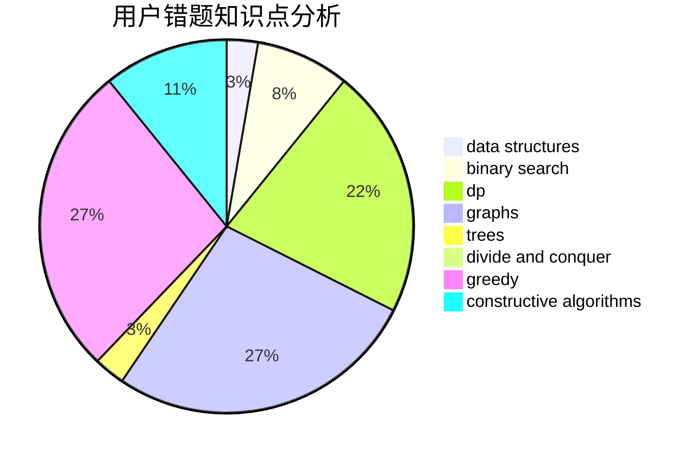

# ChiakiNanami

<!-- tabs:start -->

#### **用户提交结果分析**

#### **用户做题类型偏好分析**

#### **用户错题知识点分析**

<!-- tabs:end -->
# 推荐题目
[1401E](https://codeforces.com/contest/1401/problem/E)		data structures,
                        geometry,
                        implementation,
                        sortings		  
[261D](https://codeforces.com/contest/261/problem/D)		dp		  
[707B](https://codeforces.com/contest/707/problem/B)		graphs		  
[1028G](https://codeforces.com/contest/1028/problem/G)		dp,
                        interactive		  
[708A](https://codeforces.com/contest/708/problem/A)		constructive algorithms,
                        greedy,
                        implementation,
                        strings		  
[456B](https://codeforces.com/contest/456/problem/B)		math,
                        number theory		  
[696B](https://codeforces.com/contest/696/problem/B)		dfs and similar,
                        math,
                        probabilities,
                        trees		  
[1322A](https://codeforces.com/contest/1322/problem/A)		greedy		  
[1131B](https://codeforces.com/contest/1131/problem/B)		greedy,
                        implementation		  
[1394E](https://codeforces.com/contest/1394/problem/E)		strings		  
