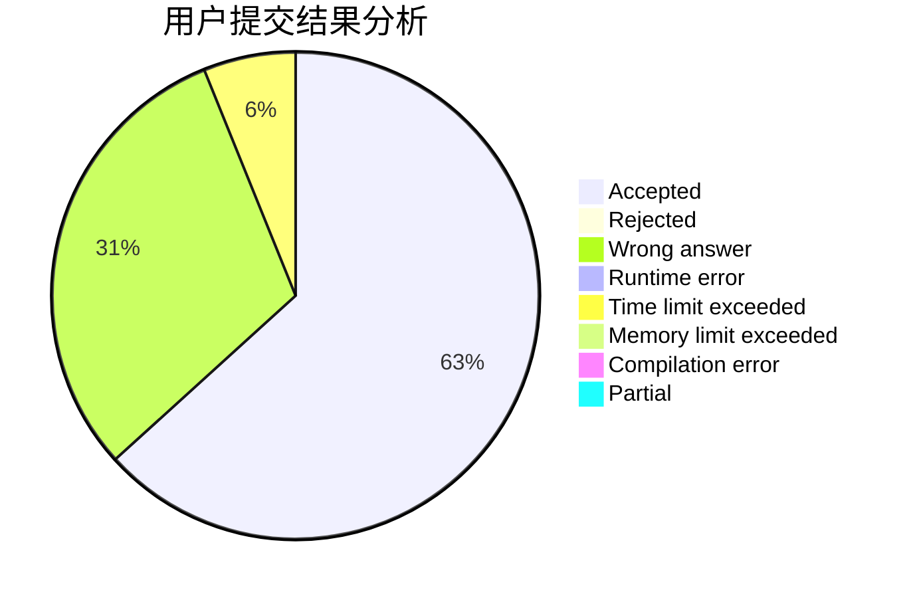
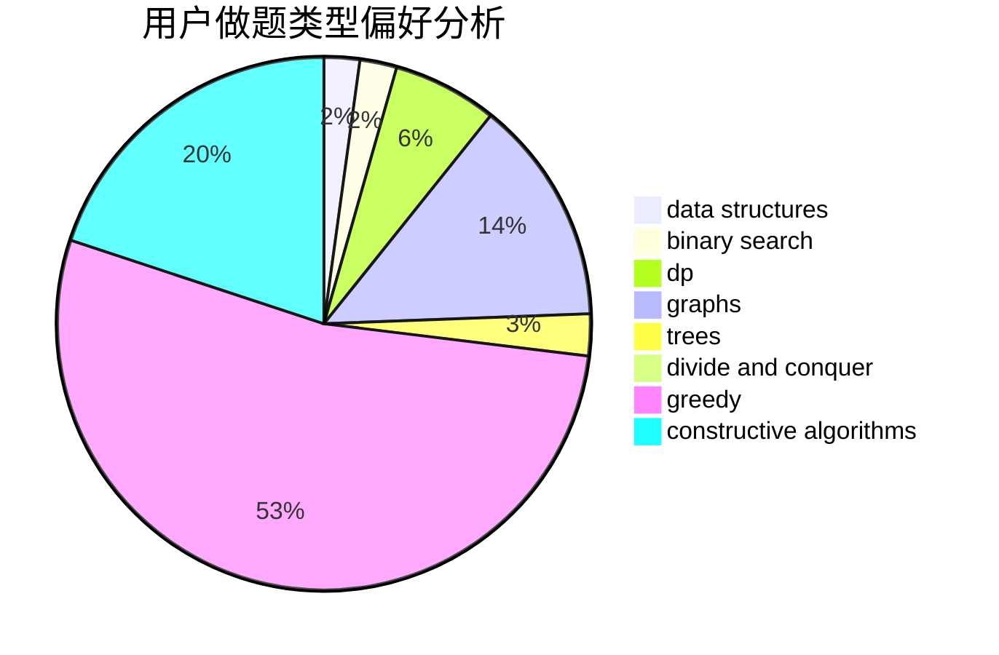
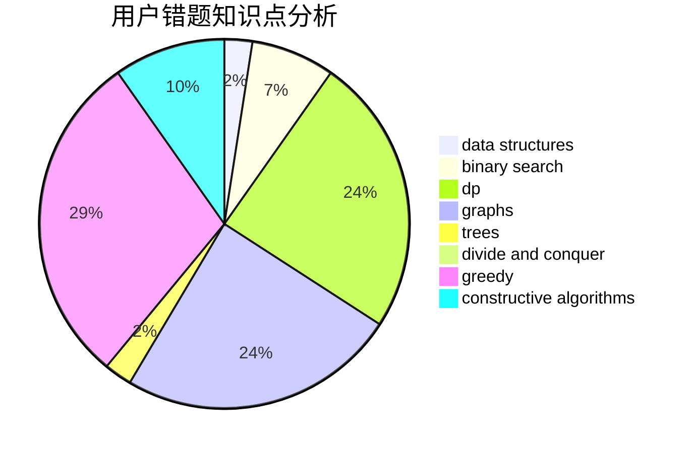

# ChiakiNanami

<!-- tabs:start -->

#### **用户提交结果分析**

#### **用户做题类型偏好分析**

#### **用户错题知识点分析**

<!-- tabs:end -->
# 推荐题目
[1393E2](https://codeforces.com/contest/1393E/problem/2)		dp,
                        hashing,
                        implementation,
                        string suffix structures,
                        strings,
                        two pointers		  
[240F](https://codeforces.com/contest/240/problem/F)		data structures		  
[683A](https://codeforces.com/contest/683/problem/A)		*special problem,
                        geometry		  
[1028C](https://codeforces.com/contest/1028/problem/C)		geometry,
                        implementation,
                        sortings		  
[686A](https://codeforces.com/contest/686/problem/A)		constructive algorithms,
                        implementation		  
[436B](https://codeforces.com/contest/436/problem/B)		implementation,
                        math		  
[670D1](https://codeforces.com/contest/670D/problem/1)		binary search,
                        brute force,
                        implementation		  
[1312E](https://codeforces.com/contest/1312/problem/E)		dp,
                        greedy		  
[1129B](https://codeforces.com/contest/1129/problem/B)		constructive algorithms		  
[1384E](https://codeforces.com/contest/1384/problem/E)		dsu,graphs,sortings,trees		  
