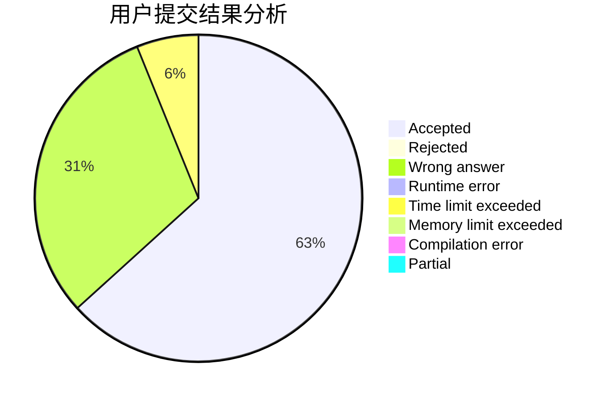
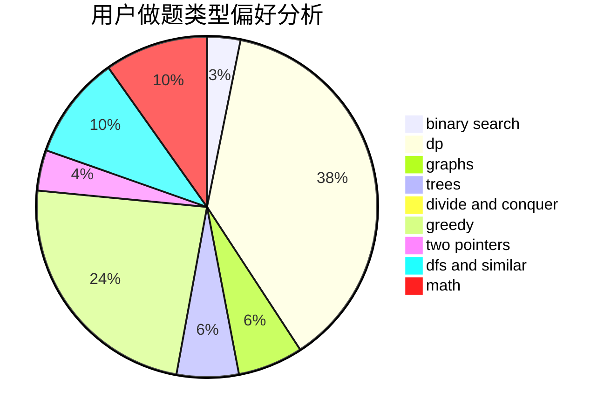

# ChiakiNanami

<!-- tabs:start -->

#### **用户提交结果分析**

#### **用户做题类型偏好分析**

<!-- tabs:end -->
# 推荐题目
[1401E](https://codeforces.com/contest/1401/problem/E)
[261D](https://codeforces.com/contest/261/problem/D)
[707B](https://codeforces.com/contest/707/problem/B)
[1028G](https://codeforces.com/contest/1028/problem/G)
[708A](https://codeforces.com/contest/708/problem/A)
[456B](https://codeforces.com/contest/456/problem/B)
[696B](https://codeforces.com/contest/696/problem/B)
[1322A](https://codeforces.com/contest/1322/problem/A)
[1131B](https://codeforces.com/contest/1131/problem/B)
[1394E](https://codeforces.com/contest/1394/problem/E)
