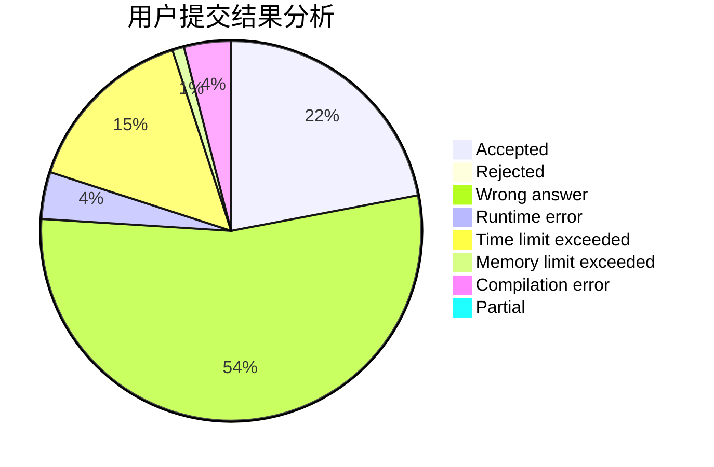
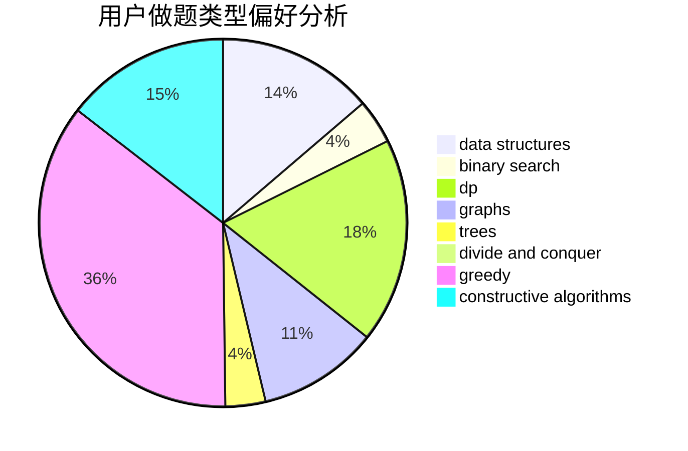
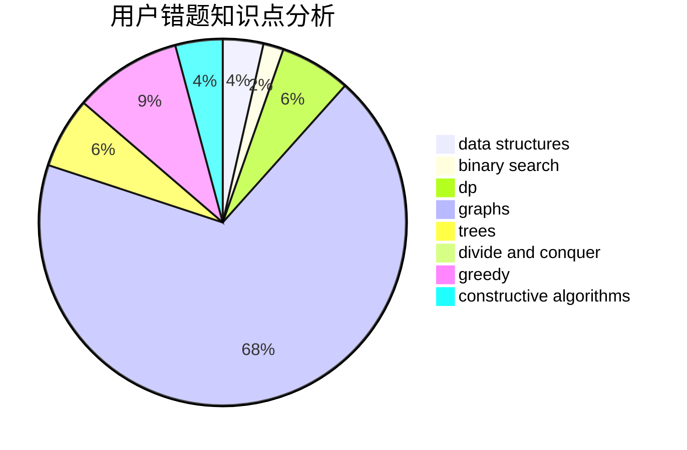

# zucc31801313

<!-- tabs:start -->

#### **用户提交结果分析**

#### **用户做题类型偏好分析**

#### **用户错题知识点分析**

<!-- tabs:end -->
# 推荐题目
[1106E](https://codeforces.com/contest/1106/problem/E)		data structures,
                        dp		  
[764A](https://codeforces.com/contest/764/problem/A)		brute force,
                        implementation,
                        math		  
[1080E](https://codeforces.com/contest/1080/problem/E)		strings		  
[1000G](https://codeforces.com/contest/1000/problem/G)		data structures,
                        dp,
                        trees		  
[671E](https://codeforces.com/contest/671/problem/E)		data structures,
                        greedy		  
[660C](https://codeforces.com/contest/660/problem/C)		binary search,
                        dp,
                        two pointers		  
[868B](https://codeforces.com/contest/868/problem/B)		implementation		  
[903A](https://codeforces.com/contest/903/problem/A)		greedy,
                        implementation		  
[292E](https://codeforces.com/contest/292/problem/E)		data structures		  
[915D](https://codeforces.com/contest/915/problem/D)		dfs and similar,
                        graphs		  
