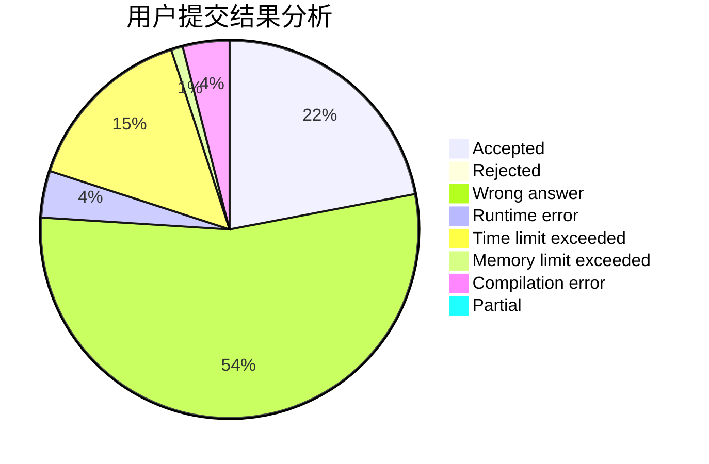
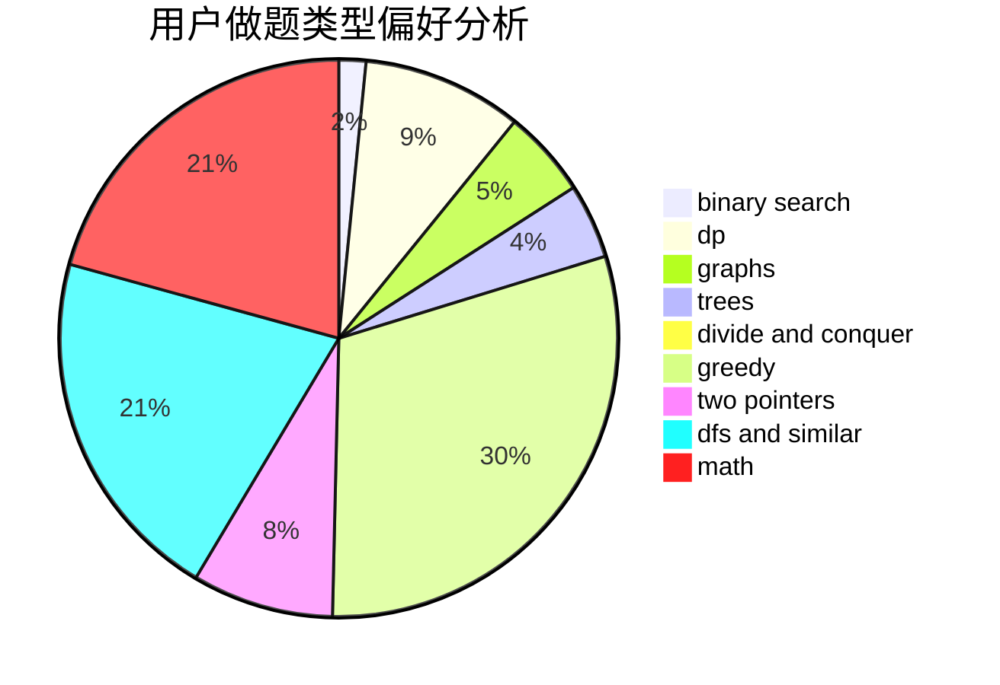

# zucc31801313

<!-- tabs:start -->

#### **用户提交结果分析**

#### **用户做题类型偏好分析**

<!-- tabs:end -->
# 推荐题目
[1106E](https://codeforces.com/contest/1106/problem/E)
[764A](https://codeforces.com/contest/764/problem/A)
[1080E](https://codeforces.com/contest/1080/problem/E)
[1000G](https://codeforces.com/contest/1000/problem/G)
[671E](https://codeforces.com/contest/671/problem/E)
[660C](https://codeforces.com/contest/660/problem/C)
[868B](https://codeforces.com/contest/868/problem/B)
[903A](https://codeforces.com/contest/903/problem/A)
[292E](https://codeforces.com/contest/292/problem/E)
[915D](https://codeforces.com/contest/915/problem/D)
