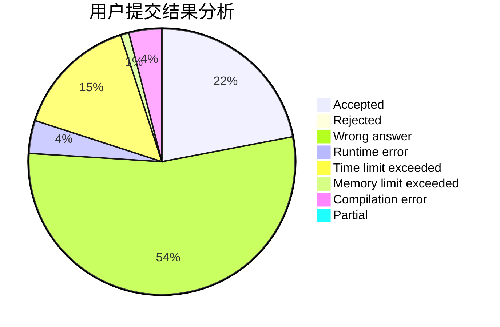
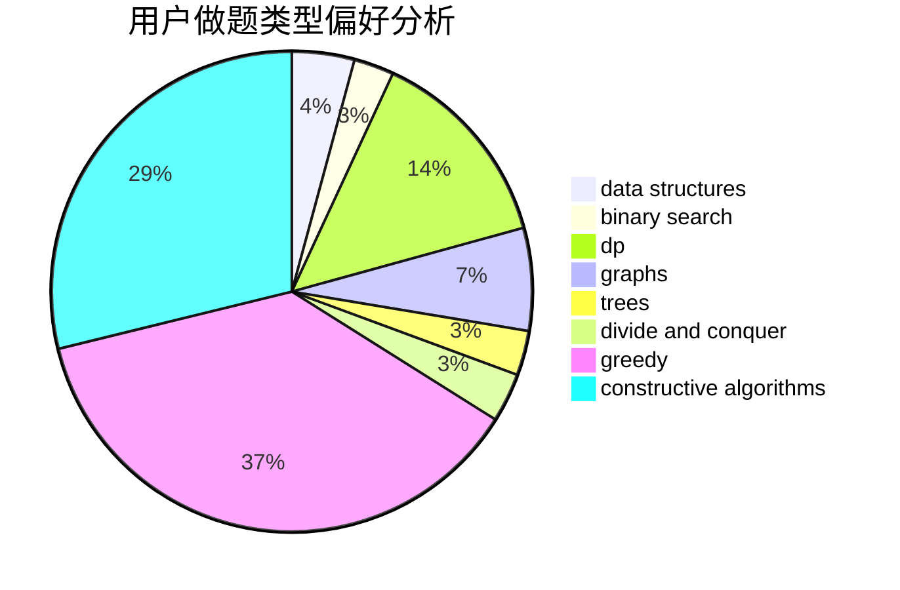
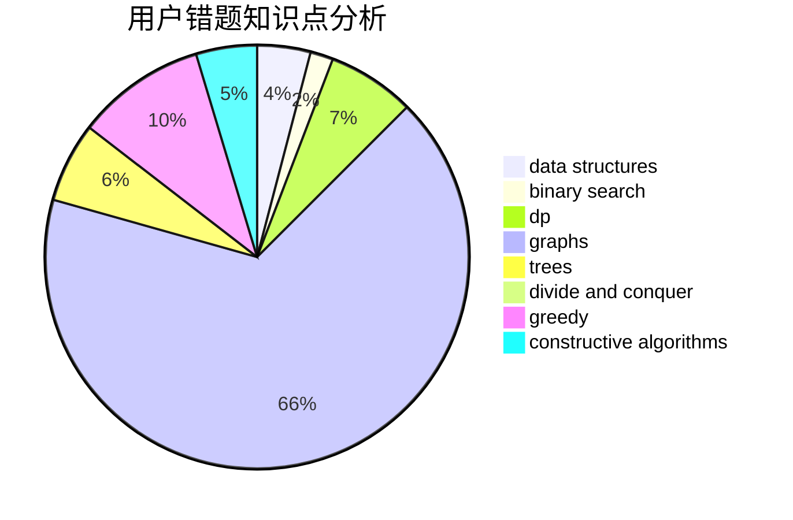

# zucc31801313

<!-- tabs:start -->

#### **用户提交结果分析**

#### **用户做题类型偏好分析**

#### **用户错题知识点分析**

<!-- tabs:end -->
# 推荐题目
[1106B](https://codeforces.com/contest/1106/problem/B)		data structures,
                        implementation		  
[743E](https://codeforces.com/contest/743/problem/E)		binary search,
                        bitmasks,
                        brute force,
                        dp		  
[1080B](https://codeforces.com/contest/1080/problem/B)		math		  
[1000G](https://codeforces.com/contest/1000/problem/G)		data structures,
                        dp,
                        trees		  
[645D](https://codeforces.com/contest/645/problem/D)		binary search,
                        dp,
                        graphs		  
[630G](https://codeforces.com/contest/630/problem/G)		combinatorics,
                        math		  
[848E](https://codeforces.com/contest/848/problem/E)		combinatorics,
                        divide and conquer,
                        dp,
                        fft,
                        math		  
[884D](https://codeforces.com/contest/884/problem/D)		data structures,
                        greedy		  
[277D](https://codeforces.com/contest/277/problem/D)		dp,
                        probabilities		  
[899D](https://codeforces.com/contest/899/problem/D)		constructive algorithms,
                        math		  
