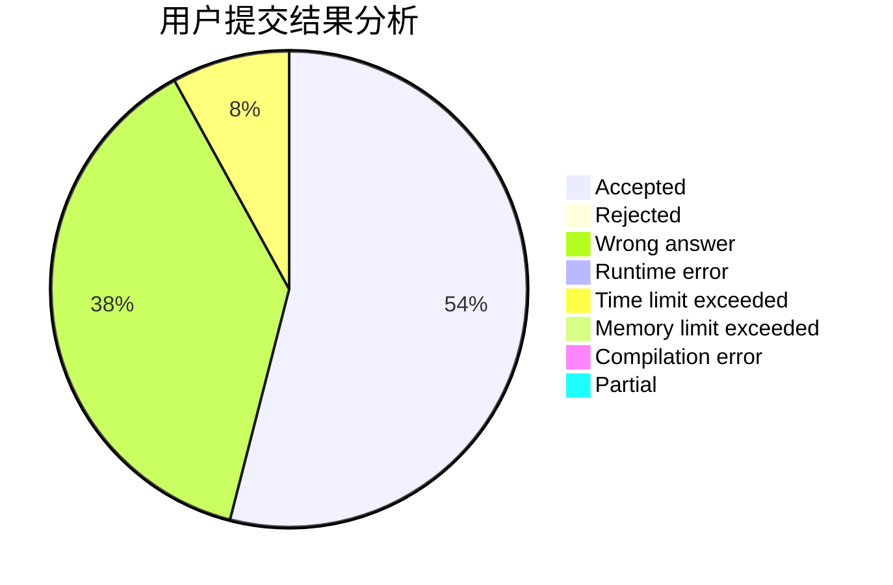
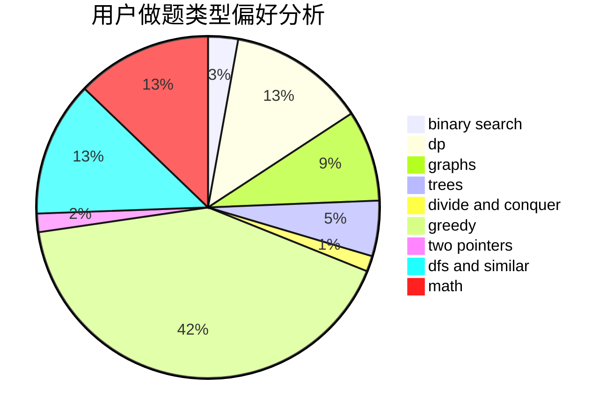

# zucc31901019

<!-- tabs:start -->

#### **用户提交结果分析**

#### **用户做题类型偏好分析**

<!-- tabs:end -->
# 推荐题目
[1337E](https://codeforces.com/contest/1337/problem/E)
[226E](https://codeforces.com/contest/226/problem/E)
[606C](https://codeforces.com/contest/606/problem/C)
[611A](https://codeforces.com/contest/611/problem/A)
[3C](https://codeforces.com/contest/3/problem/C)
[1203A](https://codeforces.com/contest/1203/problem/A)
[1164H](https://codeforces.com/contest/1164/problem/H)
[1148E](https://codeforces.com/contest/1148/problem/E)
[98A](https://codeforces.com/contest/98/problem/A)
[575H](https://codeforces.com/contest/575/problem/H)
