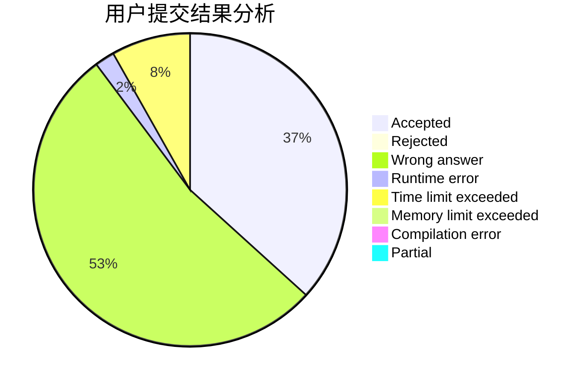
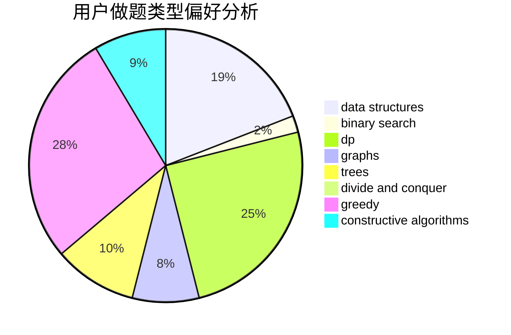
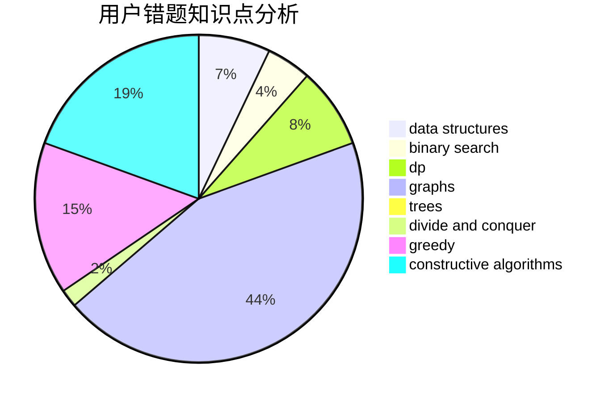

# zuoyifan

<!-- tabs:start -->

#### **用户提交结果分析**

#### **用户做题类型偏好分析**

#### **用户错题知识点分析**

<!-- tabs:end -->
# 推荐题目
[599D](https://codeforces.com/contest/599/problem/D)		brute force,
                        math		  
[1332F](https://codeforces.com/contest/1332/problem/F)		dfs and similar,
                        dp,
                        trees		  
[659F](https://codeforces.com/contest/659/problem/F)		dfs and similar,
                        dsu,
                        graphs,
                        greedy,
                        sortings		  
[778C](https://codeforces.com/contest/778/problem/C)		brute force,
                        dfs and similar,
                        dsu,
                        hashing,
                        strings,
                        trees		  
[719A](https://codeforces.com/contest/719/problem/A)		implementation		  
[762E](https://codeforces.com/contest/762/problem/E)		binary search,
                        data structures		  
[389B](https://codeforces.com/contest/389/problem/B)		greedy,
                        implementation		  
[1327A](https://codeforces.com/contest/1327/problem/A)		math		  
[1215B](https://codeforces.com/contest/1215/problem/B)		combinatorics,
                        dp,
                        implementation		  
[1271A](https://codeforces.com/contest/1271/problem/A)		brute force,
                        greedy,
                        math		  
