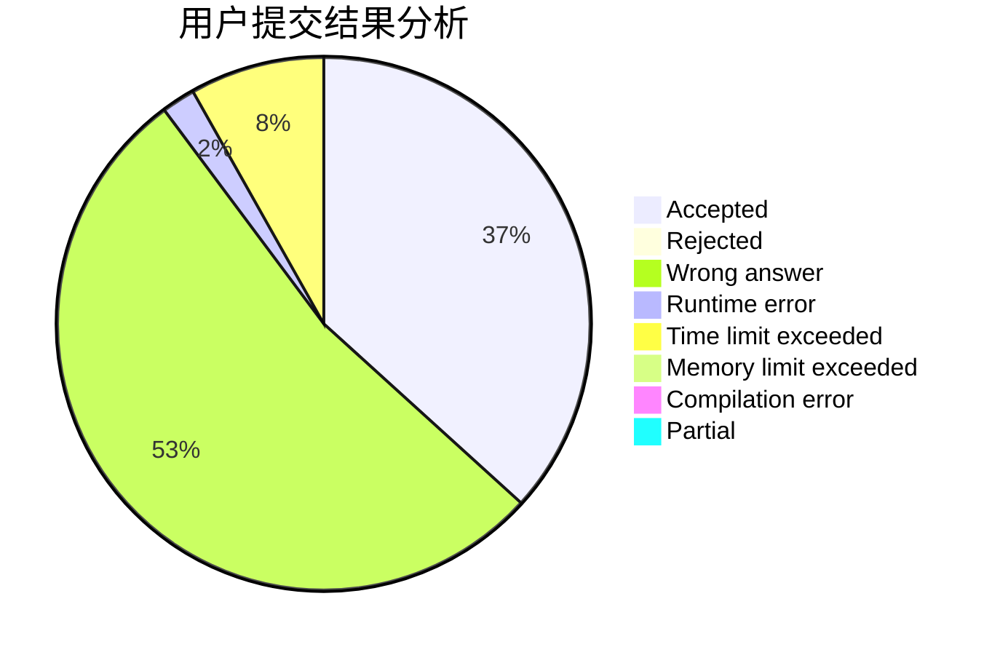
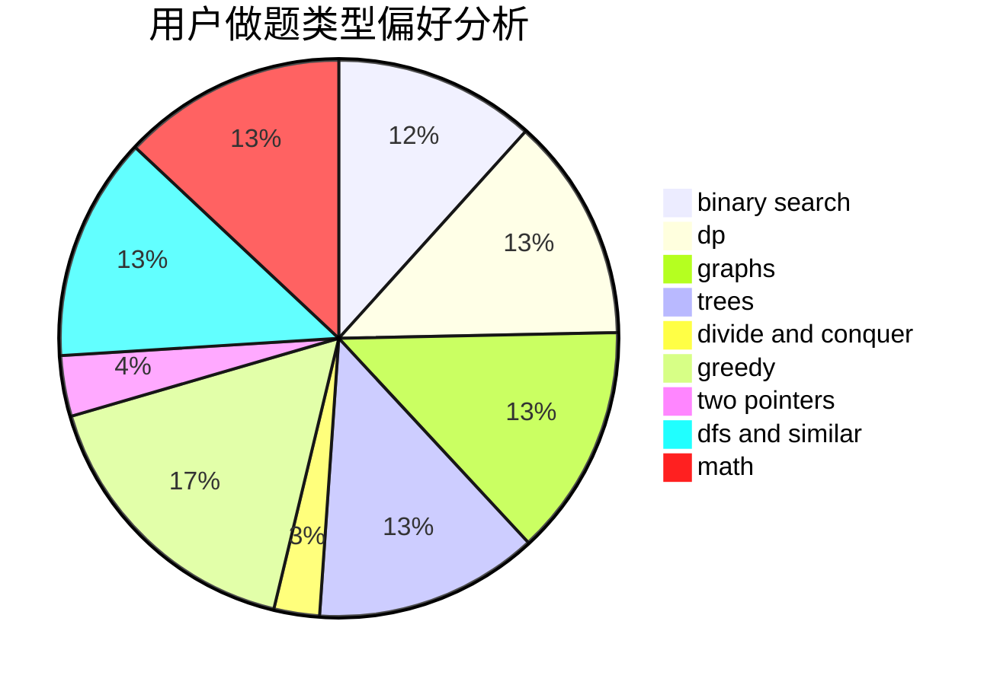

# zuoyifan

<!-- tabs:start -->

#### **用户提交结果分析**

#### **用户做题类型偏好分析**

<!-- tabs:end -->
# 推荐题目
[617E](https://codeforces.com/contest/617/problem/E)
[1339C](https://codeforces.com/contest/1339/problem/C)
[67A](https://codeforces.com/contest/67/problem/A)
[796D](https://codeforces.com/contest/796/problem/D)
[736B](https://codeforces.com/contest/736/problem/B)
[781C](https://codeforces.com/contest/781/problem/C)
[418D](https://codeforces.com/contest/418/problem/D)
[1333D](https://codeforces.com/contest/1333/problem/D)
[1220F](https://codeforces.com/contest/1220/problem/F)
[1280C](https://codeforces.com/contest/1280/problem/C)
