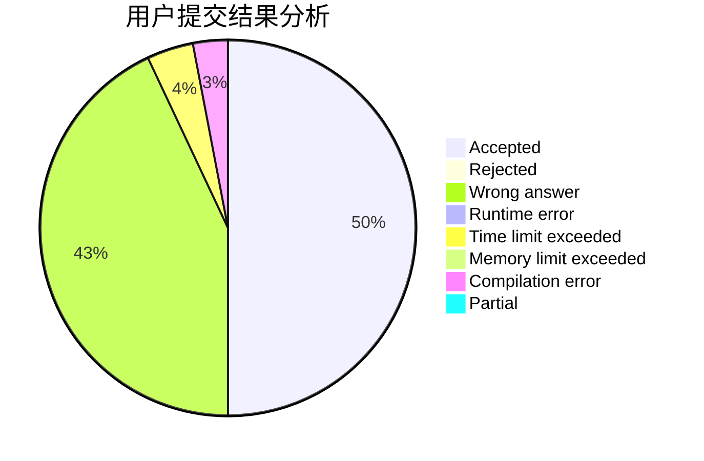
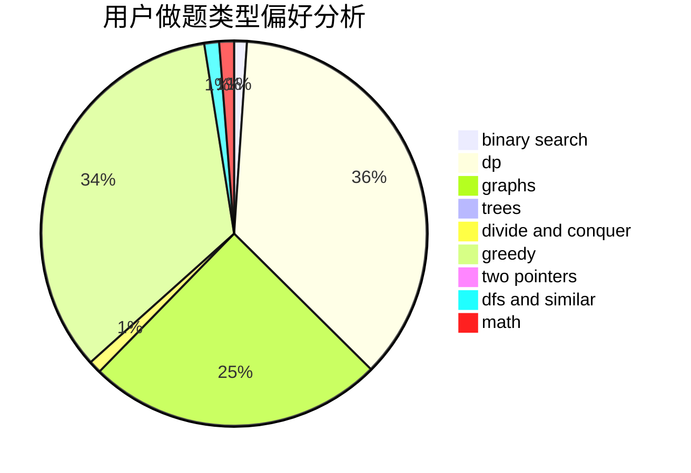

# zw_fan

<!-- tabs:start -->

#### **用户提交结果分析**

#### **用户做题类型偏好分析**

<!-- tabs:end -->
# 推荐题目
[1037C](https://codeforces.com/contest/1037/problem/C)
[1509F](https://codeforces.com/contest/1509/problem/F)
[1077D](https://codeforces.com/contest/1077/problem/D)
[1230F](https://codeforces.com/contest/1230/problem/F)
[291B](https://codeforces.com/contest/291/problem/B)
[600B](https://codeforces.com/contest/600/problem/B)
[1008C](https://codeforces.com/contest/1008/problem/C)
[226B](https://codeforces.com/contest/226/problem/B)
[204C](https://codeforces.com/contest/204/problem/C)
[550C](https://codeforces.com/contest/550/problem/C)
