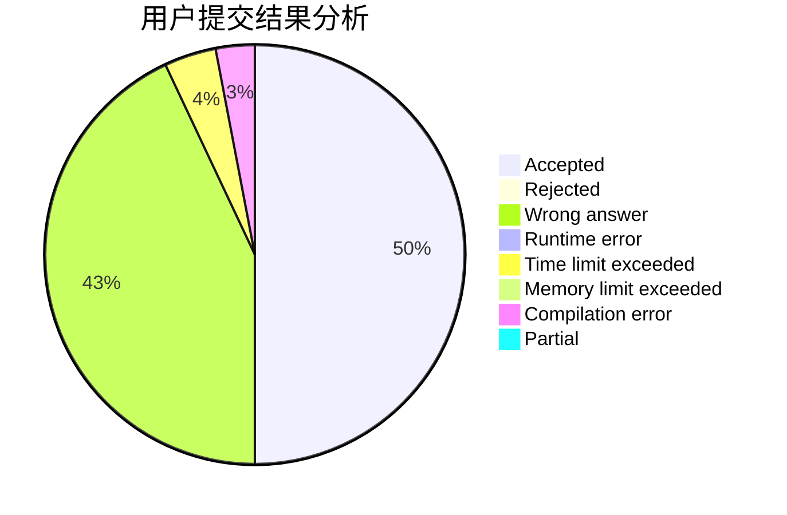
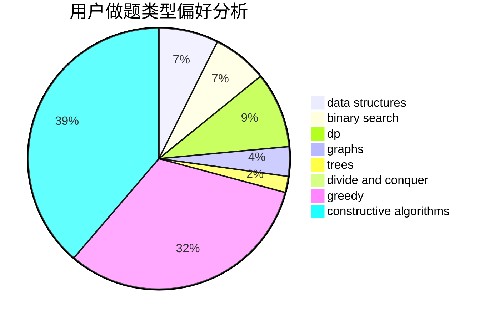
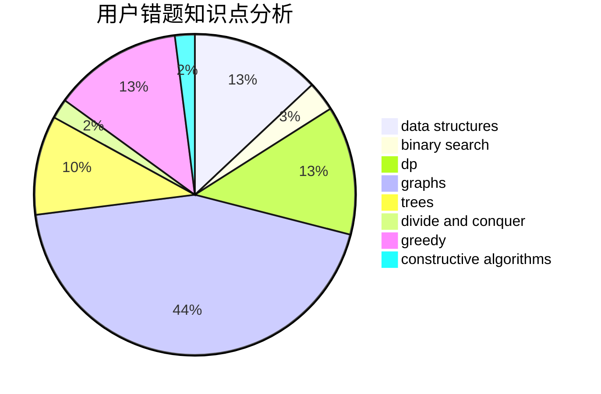

# zw_fan

<!-- tabs:start -->

#### **用户提交结果分析**

#### **用户做题类型偏好分析**

#### **用户错题知识点分析**

<!-- tabs:end -->
# 推荐题目
[1036F](https://codeforces.com/contest/1036/problem/F)		combinatorics,
                        math,
                        number theory		  
[1499F](https://codeforces.com/contest/1499/problem/F)		combinatorics,
                        dfs and similar,
                        dp,
                        trees		  
[1077C](https://codeforces.com/contest/1077/problem/C)		nan		  
[1223G](https://codeforces.com/contest/1223/problem/G)		binary search,
                        math,
                        number theory		  
[276E](https://codeforces.com/contest/276/problem/E)		data structures,
                        graphs,
                        trees		  
[57D](https://codeforces.com/contest/57/problem/D)		dp,
                        math		  
[1007E](https://codeforces.com/contest/1007/problem/E)		dp		  
[201C](https://codeforces.com/contest/201/problem/C)		dp		  
[177B2](https://codeforces.com/contest/177B/problem/2)		number theory		  
[526D](https://codeforces.com/contest/526/problem/D)		hashing,
                        string suffix structures,
                        strings		  
