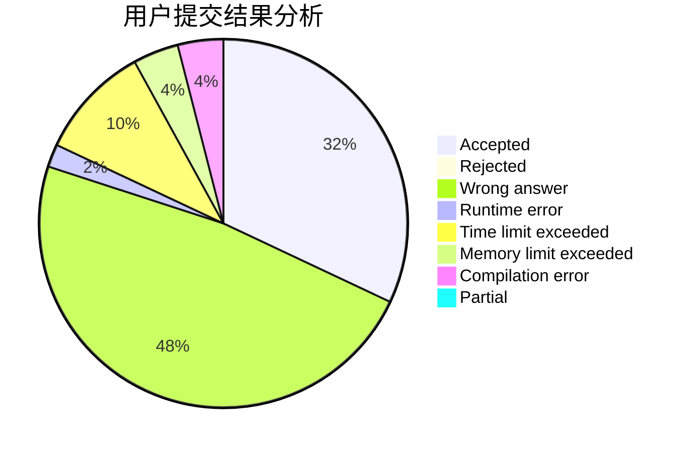
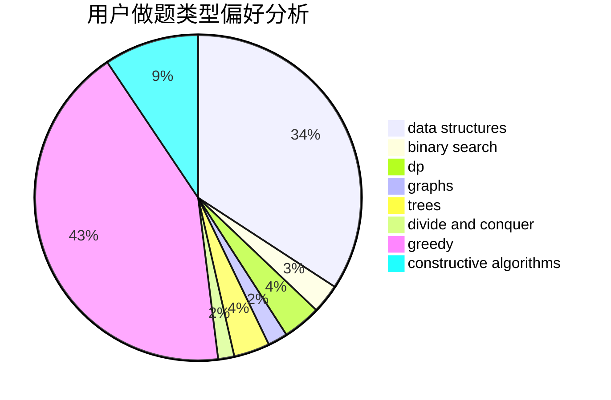

# zwu_2017010896

<!-- tabs:start -->

#### **用户提交结果分析**

#### **用户做题类型偏好分析**

#### **用户错题知识点分析**

<!-- tabs:end -->
# 推荐题目
[1478D](https://codeforces.com/contest/1478/problem/D)		dsu,graphs,sortings,trees		  
[946F](https://codeforces.com/contest/946/problem/F)		combinatorics,
                        dp,
                        matrices		  
[584B](https://codeforces.com/contest/584/problem/B)		combinatorics		  
[582B](https://codeforces.com/contest/582/problem/B)		constructive algorithms,
                        dp,
                        matrices		  
[335F](https://codeforces.com/contest/335/problem/F)		dp,
                        greedy		  
[1287A](https://codeforces.com/contest/1287/problem/A)		greedy,
                        implementation		  
[1142D](https://codeforces.com/contest/1142/problem/D)		dp		  
[343A](https://codeforces.com/contest/343/problem/A)		math,
                        number theory		  
[292A](https://codeforces.com/contest/292/problem/A)		implementation		  
[1381B](https://codeforces.com/contest/1381/problem/B)		dp		  
