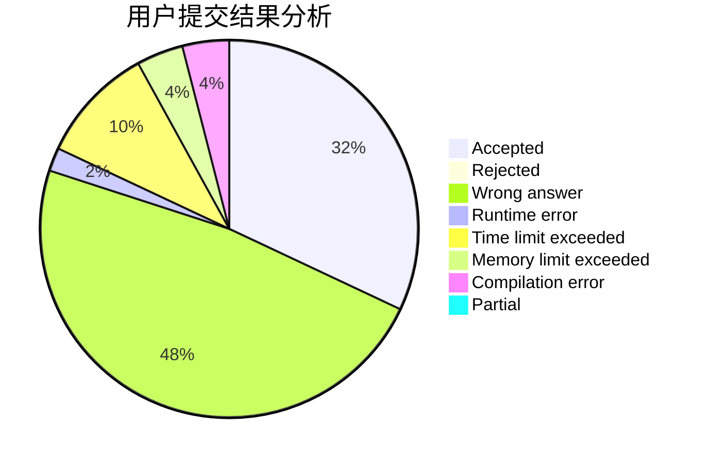
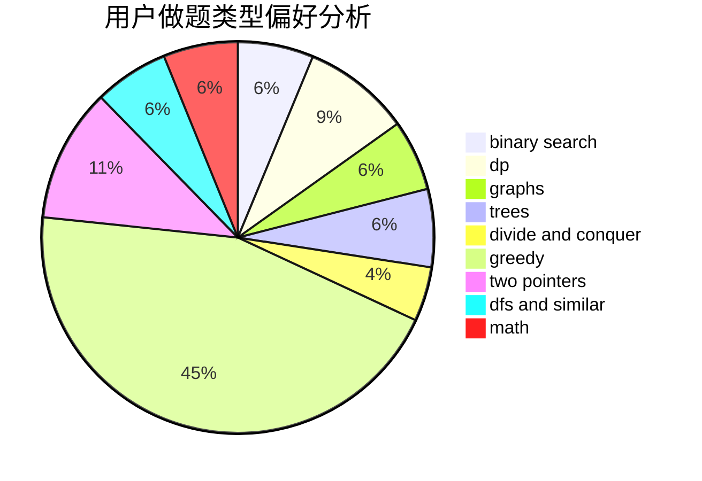

# zwu_2017010896

<!-- tabs:start -->

#### **用户提交结果分析**

#### **用户做题类型偏好分析**

<!-- tabs:end -->
# 推荐题目
[1487B](https://codeforces.com/contest/1487/problem/B)
[963C](https://codeforces.com/contest/963/problem/C)
[604B](https://codeforces.com/contest/604/problem/B)
[603B](https://codeforces.com/contest/603/problem/B)
[363B](https://codeforces.com/contest/363/problem/B)
[1294D](https://codeforces.com/contest/1294/problem/D)
[1144F](https://codeforces.com/contest/1144/problem/F)
[36B](https://codeforces.com/contest/36/problem/B)
[306D](https://codeforces.com/contest/306/problem/D)
[1391D](https://codeforces.com/contest/1391/problem/D)
