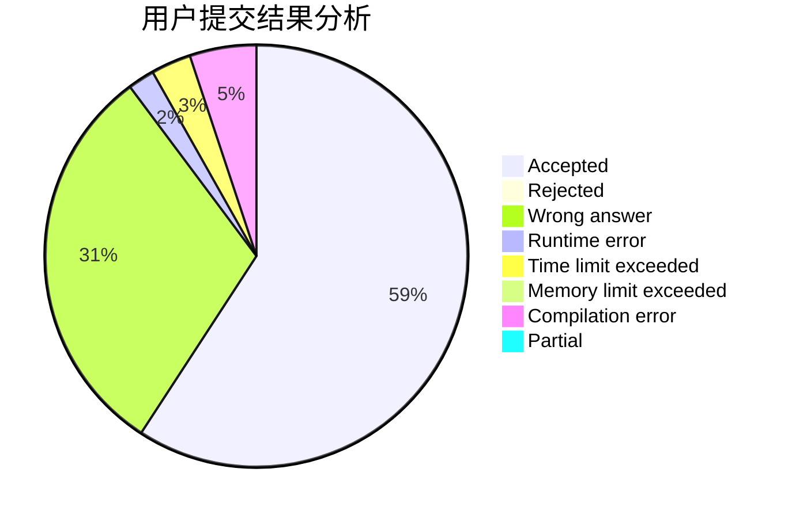
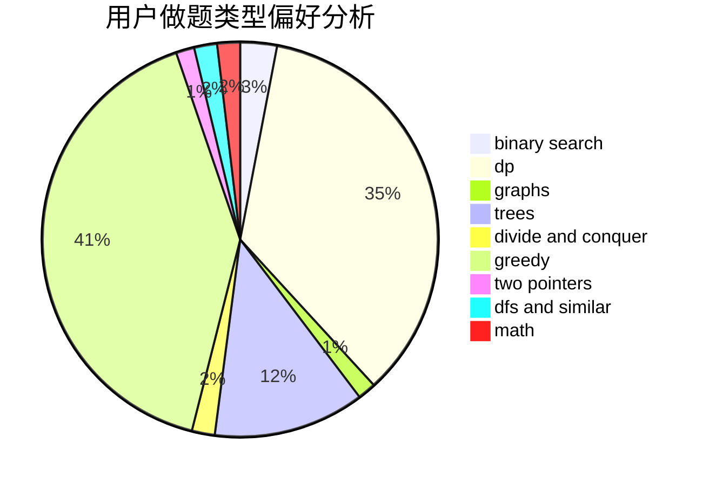

# zwuis

<!-- tabs:start -->

#### **用户提交结果分析**

#### **用户做题类型偏好分析**

<!-- tabs:end -->
# 推荐题目
[110A](https://codeforces.com/contest/110/problem/A)
[1253E](https://codeforces.com/contest/1253/problem/E)
[712C](https://codeforces.com/contest/712/problem/C)
[489F](https://codeforces.com/contest/489/problem/F)
[845F](https://codeforces.com/contest/845/problem/F)
[966E](https://codeforces.com/contest/966/problem/E)
[12162](https://codeforces.com/contest/1216/problem/2)
[999D](https://codeforces.com/contest/999/problem/D)
[290B](https://codeforces.com/contest/290/problem/B)
[457C](https://codeforces.com/contest/457/problem/C)
