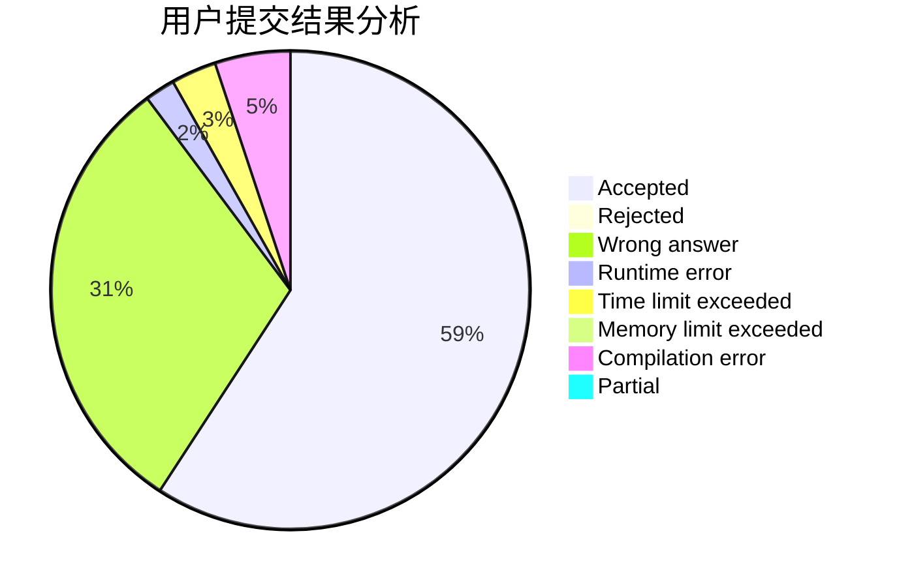
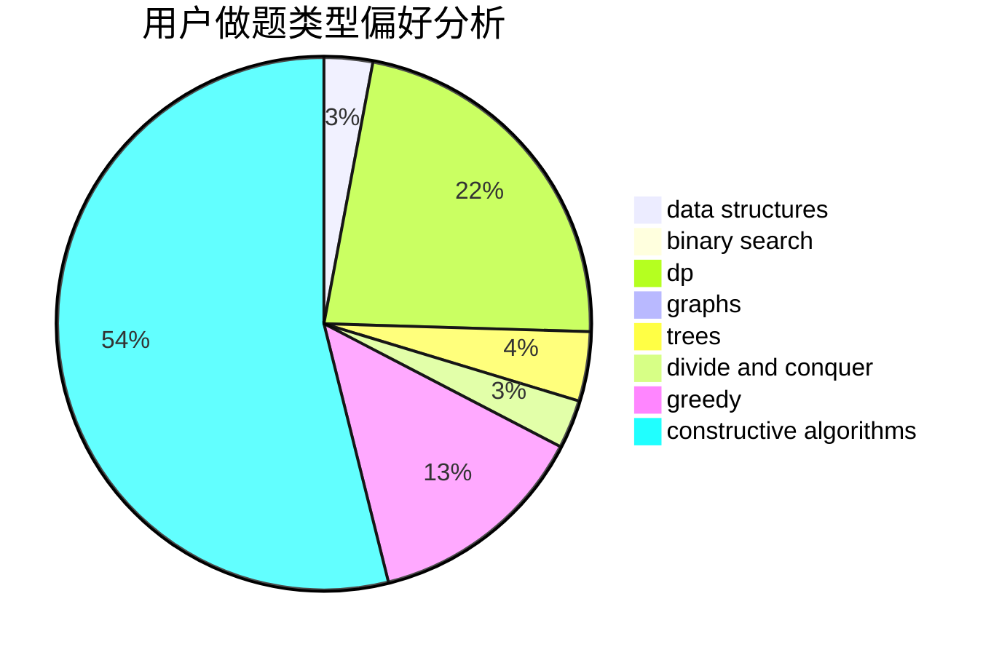
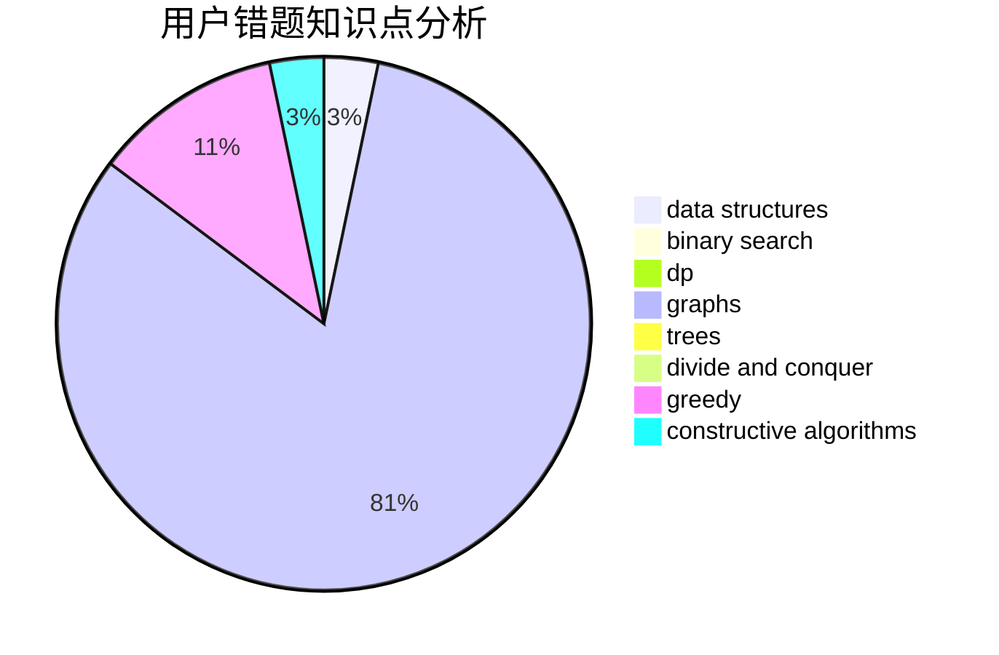

# zwuis

<!-- tabs:start -->

#### **用户提交结果分析**

#### **用户做题类型偏好分析**

#### **用户错题知识点分析**

<!-- tabs:end -->
# 推荐题目
[1109D](https://codeforces.com/contest/1109/problem/D)		brute force,
                        combinatorics,
                        dp,
                        math,
                        trees		  
[1249F](https://codeforces.com/contest/1249/problem/F)		dp,
                        trees		  
[696A](https://codeforces.com/contest/696/problem/A)		brute force,
                        data structures,
                        implementation,
                        trees		  
[471A](https://codeforces.com/contest/471/problem/A)		implementation		  
[827C](https://codeforces.com/contest/827/problem/C)		data structures,
                        strings		  
[949E](https://codeforces.com/contest/949/problem/E)		brute force		  
[120H](https://codeforces.com/contest/120/problem/H)		graph matchings		  
[983E](https://codeforces.com/contest/983/problem/E)		binary search,
                        data structures,
                        trees		  
[275B](https://codeforces.com/contest/275/problem/B)		constructive algorithms,
                        implementation		  
[436C](https://codeforces.com/contest/436/problem/C)		dsu,
                        graphs,
                        greedy,
                        trees		  
