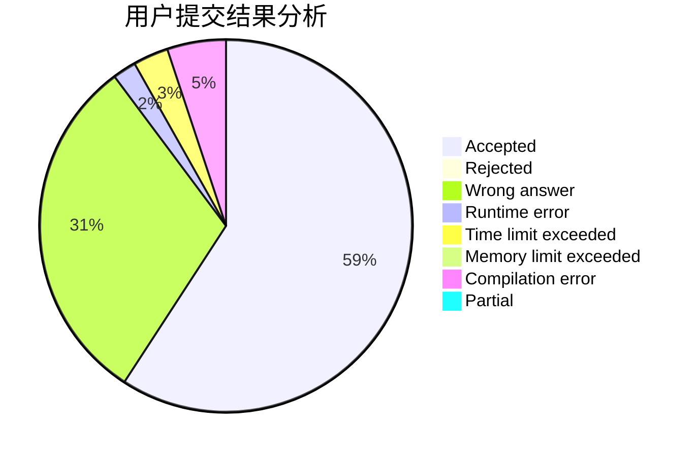
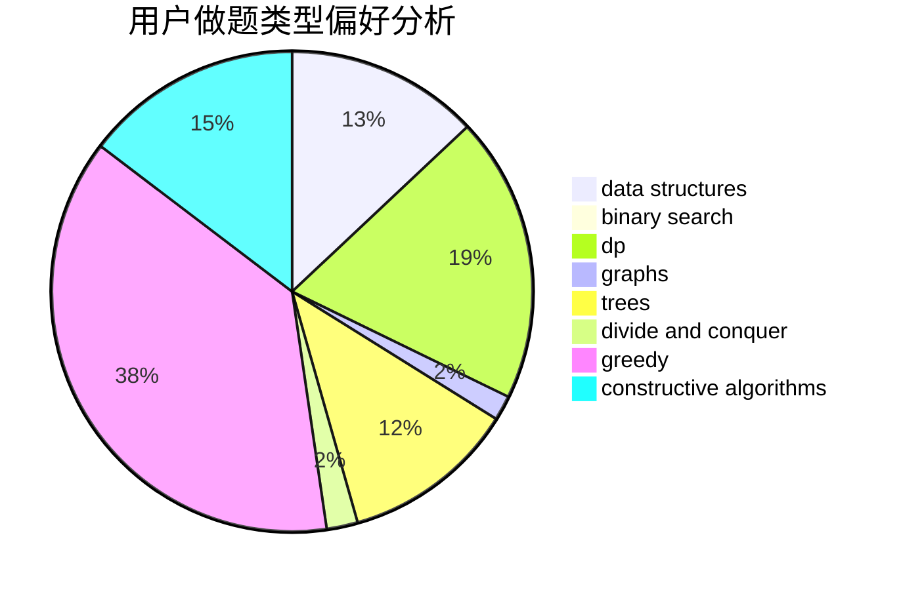
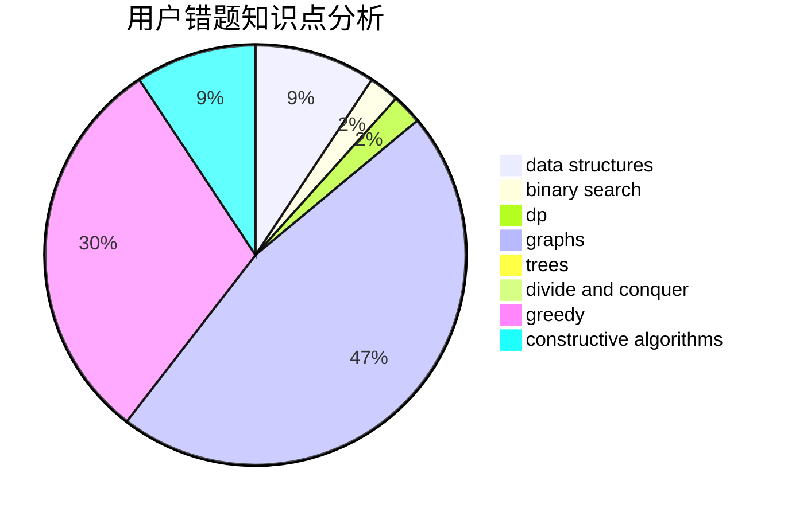

# zwuis

<!-- tabs:start -->

#### **用户提交结果分析**

#### **用户做题类型偏好分析**

#### **用户错题知识点分析**

<!-- tabs:end -->
# 推荐题目
[110A](https://codeforces.com/contest/110/problem/A)		implementation		  
[1253E](https://codeforces.com/contest/1253/problem/E)		data structures,
                        dp,
                        greedy,
                        sortings		  
[712C](https://codeforces.com/contest/712/problem/C)		greedy,
                        math		  
[489F](https://codeforces.com/contest/489/problem/F)		combinatorics,
                        dp		  
[845F](https://codeforces.com/contest/845/problem/F)		bitmasks,
                        dp		  
[966E](https://codeforces.com/contest/966/problem/E)		dsu,graphs,sortings,trees		  
[12162](https://codeforces.com/contest/1216/problem/2)		dsu,graphs,sortings,trees		  
[999D](https://codeforces.com/contest/999/problem/D)		data structures,
                        greedy,
                        implementation		  
[290B](https://codeforces.com/contest/290/problem/B)		*special problem,
                        implementation		  
[457C](https://codeforces.com/contest/457/problem/C)		brute force		  
