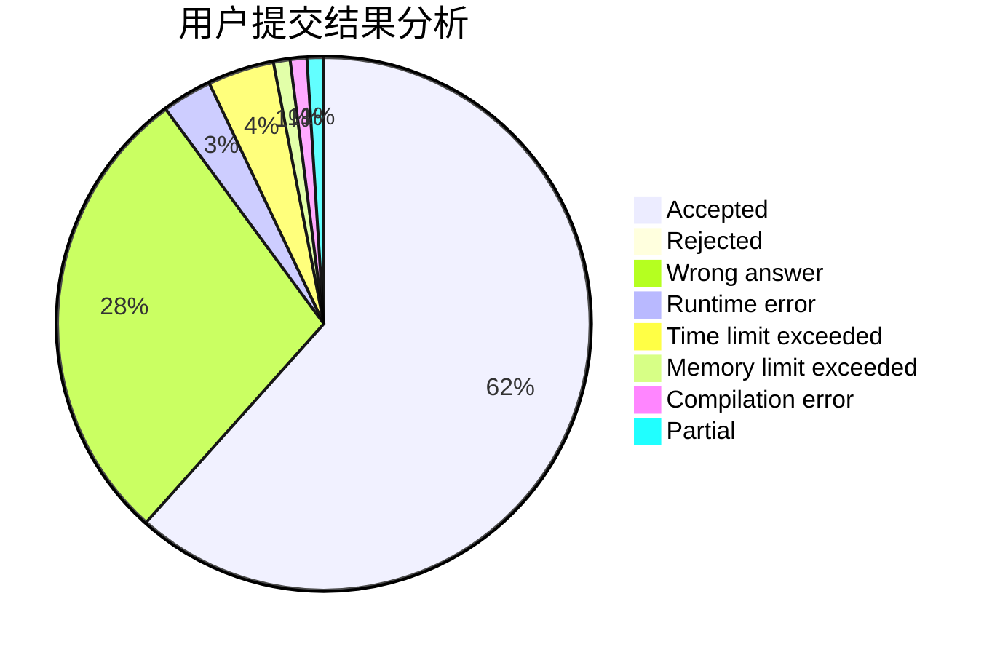
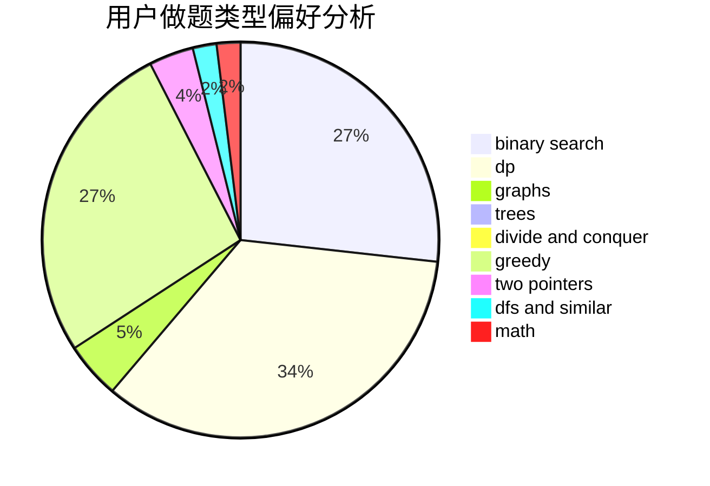

# zx2003

<!-- tabs:start -->

#### **用户提交结果分析**

#### **用户做题类型偏好分析**

<!-- tabs:end -->
# 推荐题目
[1182C](https://codeforces.com/contest/1182/problem/C)
[1144F](https://codeforces.com/contest/1144/problem/F)
[789D](https://codeforces.com/contest/789/problem/D)
[343A](https://codeforces.com/contest/343/problem/A)
[433B](https://codeforces.com/contest/433/problem/B)
[1161E](https://codeforces.com/contest/1161/problem/E)
[820C](https://codeforces.com/contest/820/problem/C)
[189B](https://codeforces.com/contest/189/problem/B)
[843B](https://codeforces.com/contest/843/problem/B)
[498A](https://codeforces.com/contest/498/problem/A)
