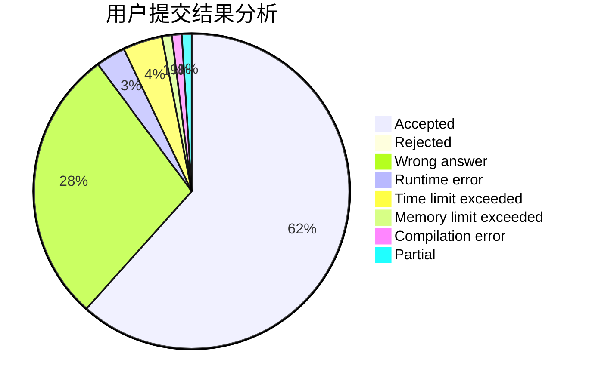
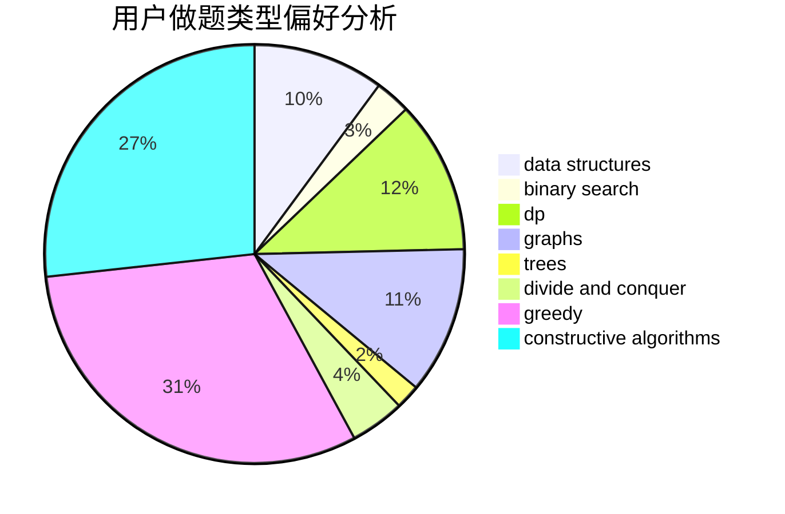
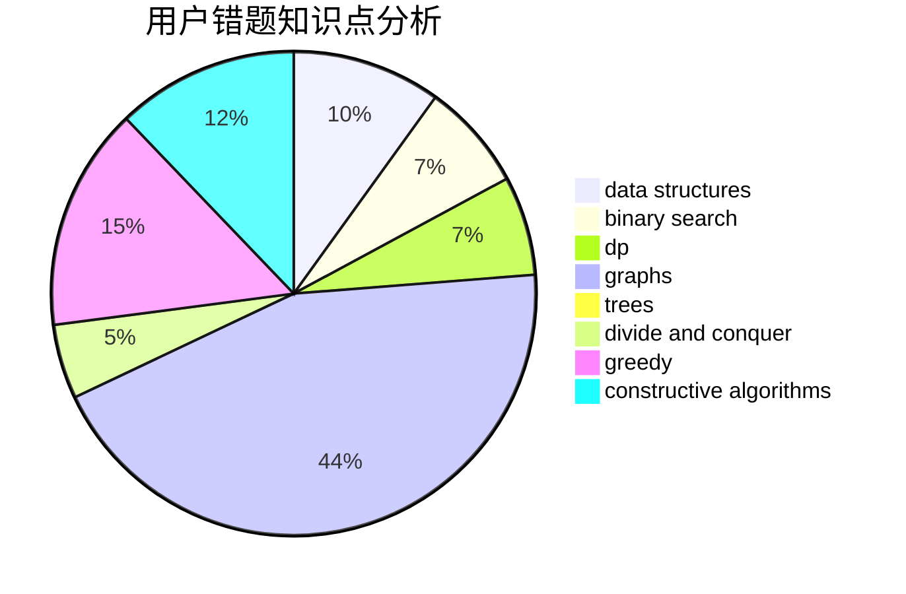

# zx2003

<!-- tabs:start -->

#### **用户提交结果分析**

#### **用户做题类型偏好分析**

#### **用户错题知识点分析**

<!-- tabs:end -->
# 推荐题目
[1179D](https://codeforces.com/contest/1179/problem/D)		data structures,
                        dp,
                        trees		  
[1142D](https://codeforces.com/contest/1142/problem/D)		dp		  
[76C](https://codeforces.com/contest/76/problem/C)		bitmasks,
                        dp,
                        math		  
[316E2](https://codeforces.com/contest/316E/problem/2)		data structures,
                        math		  
[404C](https://codeforces.com/contest/404/problem/C)		dfs and similar,
                        graphs,
                        sortings		  
[1159A](https://codeforces.com/contest/1159/problem/A)		implementation,
                        math		  
[804D](https://codeforces.com/contest/804/problem/D)		binary search,
                        brute force,
                        dfs and similar,
                        dp,
                        sortings,
                        trees		  
[163D](https://codeforces.com/contest/163/problem/D)		brute force		  
[825B](https://codeforces.com/contest/825/problem/B)		brute force,
                        implementation		  
[478A](https://codeforces.com/contest/478/problem/A)		implementation		  
