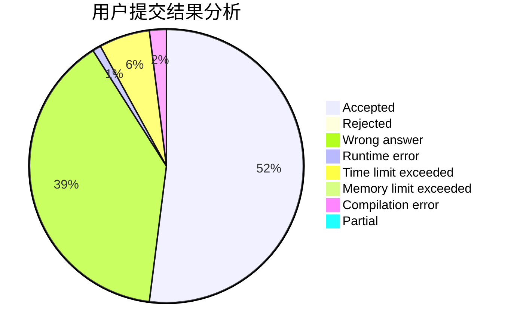
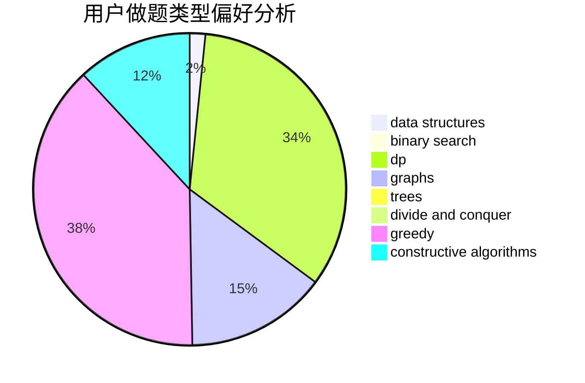
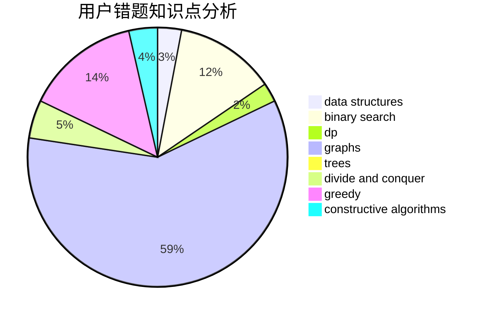

# zxtt

<!-- tabs:start -->

#### **用户提交结果分析**

#### **用户做题类型偏好分析**

#### **用户错题知识点分析**

<!-- tabs:end -->
# 推荐题目
[49E](https://codeforces.com/contest/49/problem/E)		dp		  
[699B](https://codeforces.com/contest/699/problem/B)		implementation		  
[683A](https://codeforces.com/contest/683/problem/A)		*special problem,
                        geometry		  
[762A](https://codeforces.com/contest/762/problem/A)		math,
                        number theory		  
[1146E](https://codeforces.com/contest/1146/problem/E)		bitmasks,
                        data structures,
                        divide and conquer,
                        implementation		  
[90E](https://codeforces.com/contest/90/problem/E)		dsu,graphs,sortings,trees		  
[1027A](https://codeforces.com/contest/1027/problem/A)		implementation,
                        strings		  
[1227D1](https://codeforces.com/contest/1227D/problem/1)		data structures,
                        greedy		  
[354A](https://codeforces.com/contest/354/problem/A)		brute force,
                        greedy,
                        math		  
[1280E](https://codeforces.com/contest/1280/problem/E)		math		  
