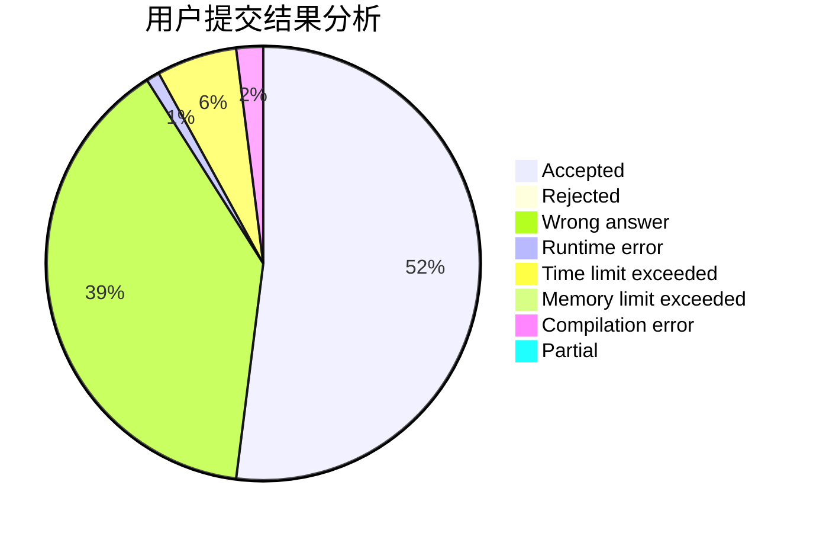
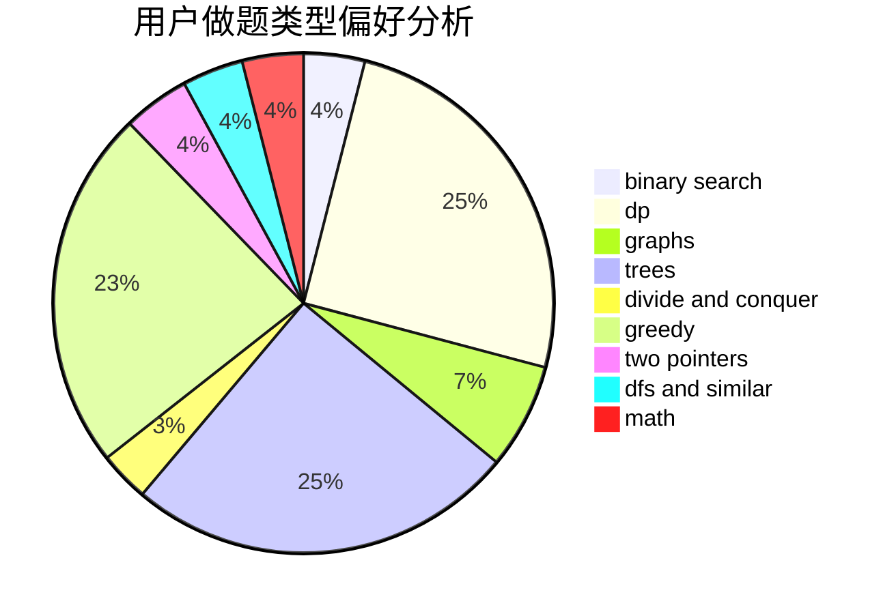

# zxtt

<!-- tabs:start -->

#### **用户提交结果分析**

#### **用户做题类型偏好分析**

<!-- tabs:end -->
# 推荐题目
[51F](https://codeforces.com/contest/51/problem/F)
[716A](https://codeforces.com/contest/716/problem/A)
[707B](https://codeforces.com/contest/707/problem/B)
[780E](https://codeforces.com/contest/780/problem/E)
[1148E](https://codeforces.com/contest/1148/problem/E)
[924E](https://codeforces.com/contest/924/problem/E)
[1027D](https://codeforces.com/contest/1027/problem/D)
[1236A](https://codeforces.com/contest/1236/problem/A)
[37D](https://codeforces.com/contest/37/problem/D)
[1286F](https://codeforces.com/contest/1286/problem/F)
