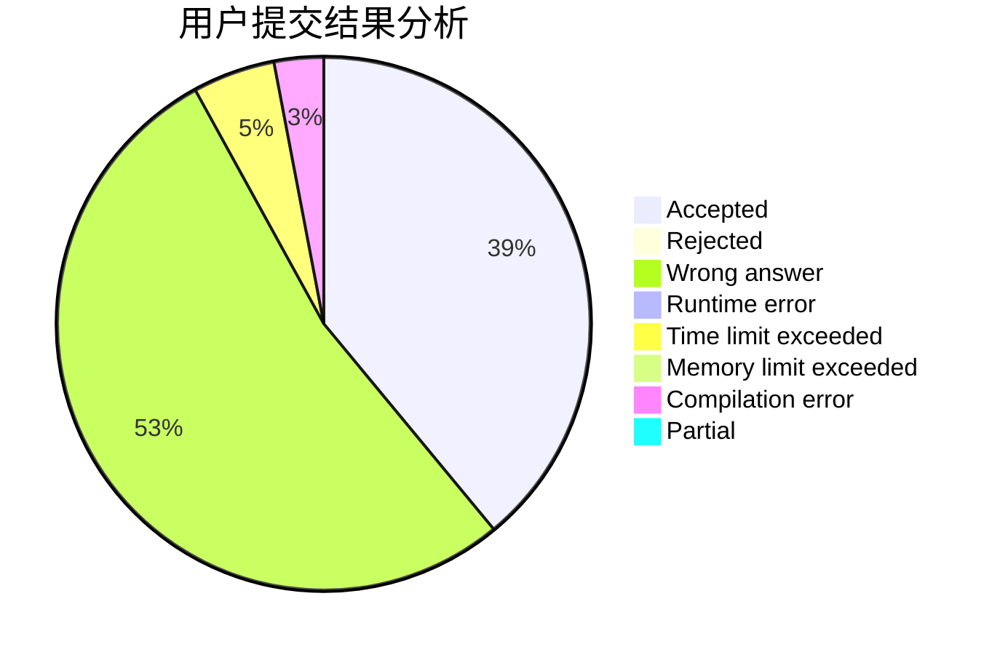
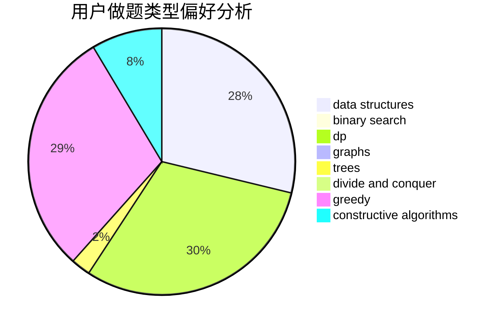
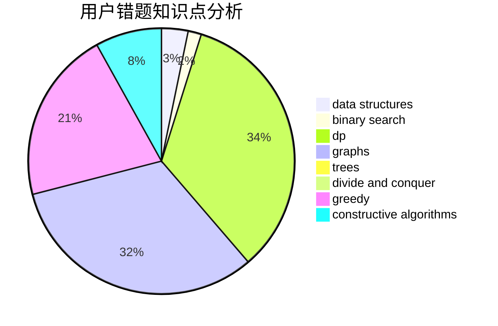

# zxwsbg

<!-- tabs:start -->

#### **用户提交结果分析**

#### **用户做题类型偏好分析**

#### **用户错题知识点分析**

<!-- tabs:end -->
# 推荐题目
[899D](https://codeforces.com/contest/899/problem/D)		constructive algorithms,
                        math		  
[1322E](https://codeforces.com/contest/1322/problem/E)		data structures		  
[220C](https://codeforces.com/contest/220/problem/C)		data structures		  
[870A](https://codeforces.com/contest/870/problem/A)		brute force,
                        implementation		  
[11951](https://codeforces.com/contest/1195/problem/1)		dsu,graphs,sortings,trees		  
[356D](https://codeforces.com/contest/356/problem/D)		bitmasks,
                        constructive algorithms,
                        dp,
                        greedy		  
[21D](https://codeforces.com/contest/21/problem/D)		bitmasks,
                        graph matchings,
                        graphs		  
[957B](https://codeforces.com/contest/957/problem/B)		dsu,graphs,sortings,trees		  
[1011A](https://codeforces.com/contest/1011/problem/A)		greedy,
                        implementation,
                        sortings		  
[1413A](https://codeforces.com/contest/1413/problem/A)		constructive algorithms,
                        math		  
