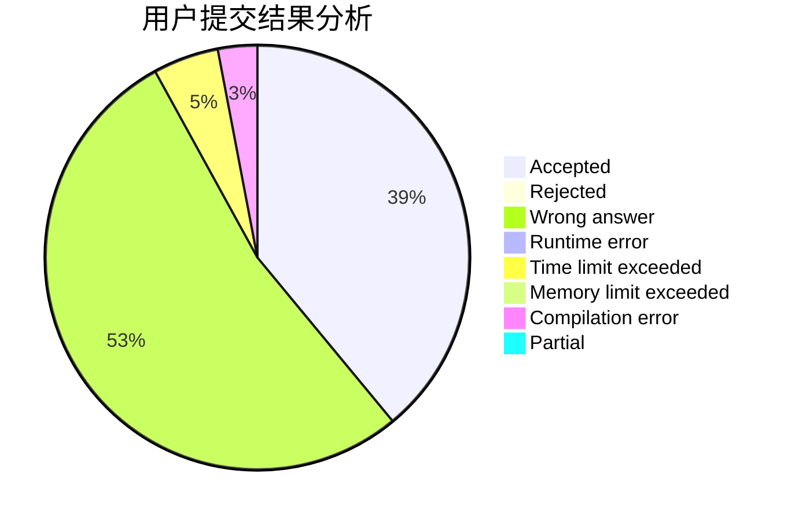
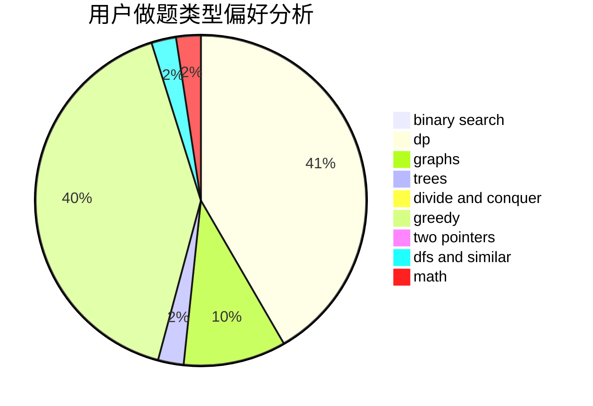

# zxwsbg

<!-- tabs:start -->

#### **用户提交结果分析**

#### **用户做题类型偏好分析**

<!-- tabs:end -->
# 推荐题目
[899D](https://codeforces.com/contest/899/problem/D)
[1322E](https://codeforces.com/contest/1322/problem/E)
[220C](https://codeforces.com/contest/220/problem/C)
[870A](https://codeforces.com/contest/870/problem/A)
[11951](https://codeforces.com/contest/1195/problem/1)
[356D](https://codeforces.com/contest/356/problem/D)
[21D](https://codeforces.com/contest/21/problem/D)
[957B](https://codeforces.com/contest/957/problem/B)
[1011A](https://codeforces.com/contest/1011/problem/A)
[1413A](https://codeforces.com/contest/1413/problem/A)
