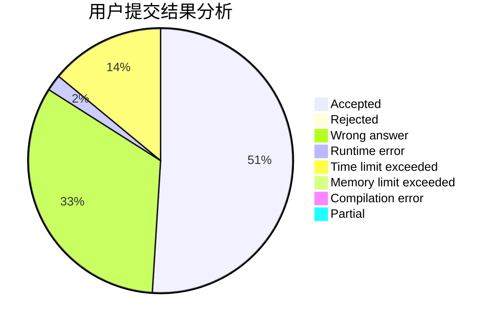
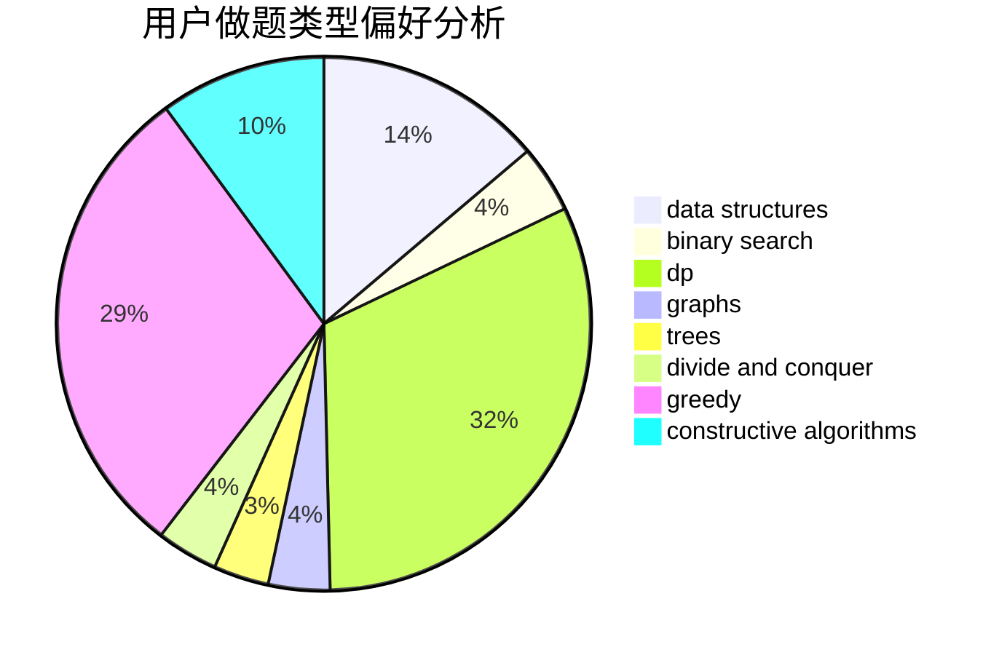

# zxx

<!-- tabs:start -->

#### **用户提交结果分析**

#### **用户做题类型偏好分析**

#### **用户错题知识点分析**

<!-- tabs:end -->
# 推荐题目
[1250I](https://codeforces.com/contest/1250/problem/I)		binary search,
                        brute force,
                        greedy,
                        shortest paths		  
[664A](https://codeforces.com/contest/664/problem/A)		math,
                        number theory		  
[699B](https://codeforces.com/contest/699/problem/B)		implementation		  
[189A](https://codeforces.com/contest/189/problem/A)		brute force,
                        dp		  
[1513F](https://codeforces.com/contest/1513/problem/F)		brute force,
                        constructive algorithms,
                        data structures,
                        sortings		  
[23B](https://codeforces.com/contest/23/problem/B)		constructive algorithms,
                        graphs,
                        math		  
[901B](https://codeforces.com/contest/901/problem/B)		constructive algorithms,
                        math		  
[1219B](https://codeforces.com/contest/1219/problem/B)		dsu,graphs,sortings,trees		  
[869A](https://codeforces.com/contest/869/problem/A)		brute force,
                        implementation		  
[1276E](https://codeforces.com/contest/1276/problem/E)		constructive algorithms		  
