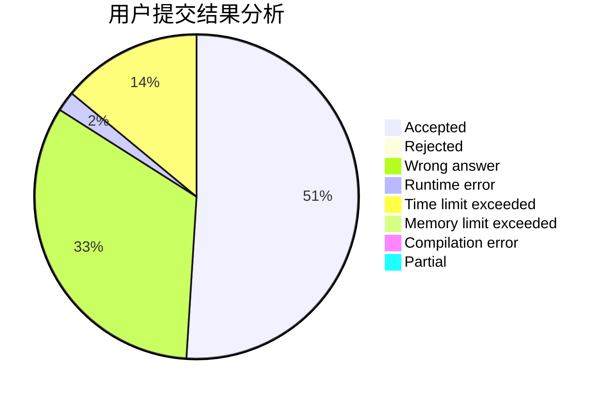
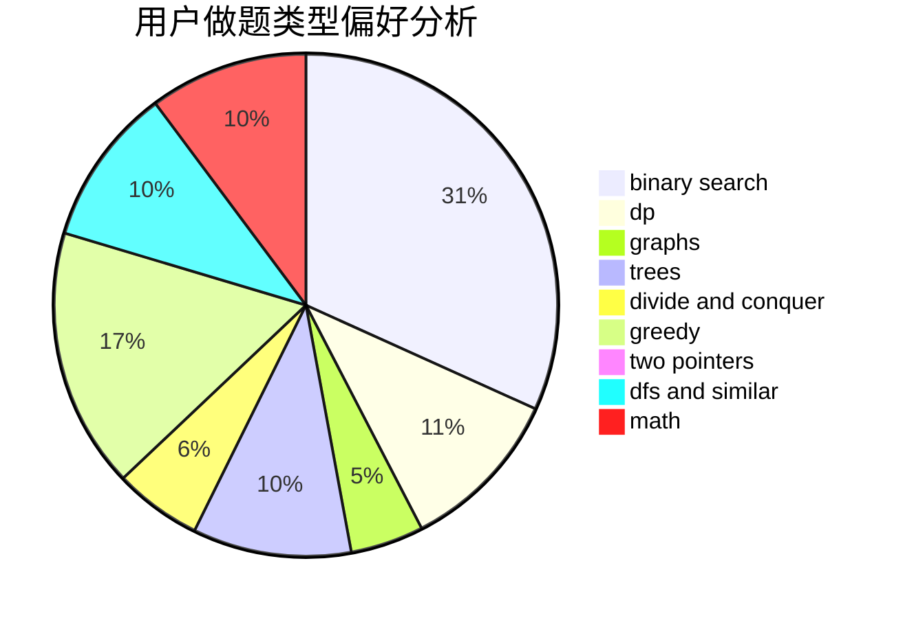

# zxx

<!-- tabs:start -->

#### **用户提交结果分析**

#### **用户做题类型偏好分析**

<!-- tabs:end -->
# 推荐题目
[1255A](https://codeforces.com/contest/1255/problem/A)
[683B](https://codeforces.com/contest/683/problem/B)
[716A](https://codeforces.com/contest/716/problem/A)
[212E](https://codeforces.com/contest/212/problem/E)
[174B](https://codeforces.com/contest/174/problem/B)
[260D](https://codeforces.com/contest/260/problem/D)
[917E](https://codeforces.com/contest/917/problem/E)
[12271](https://codeforces.com/contest/1227/problem/1)
[888D](https://codeforces.com/contest/888/problem/D)
[1283A](https://codeforces.com/contest/1283/problem/A)
