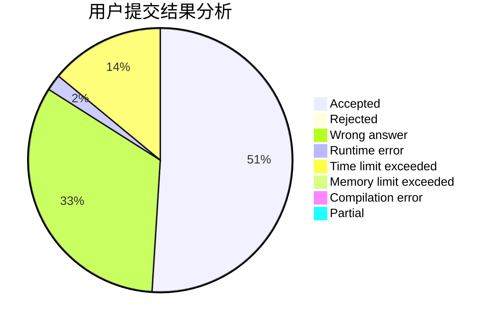
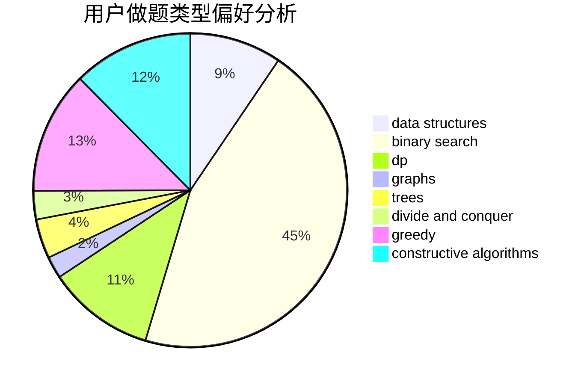

# zxx

<!-- tabs:start -->

#### **用户提交结果分析**

#### **用户做题类型偏好分析**

#### **用户错题知识点分析**

<!-- tabs:end -->
# 推荐题目
[1255A](https://codeforces.com/contest/1255/problem/A)		math		  
[683B](https://codeforces.com/contest/683/problem/B)		*special problem		  
[716A](https://codeforces.com/contest/716/problem/A)		implementation		  
[212E](https://codeforces.com/contest/212/problem/E)		dfs and similar,
                        dp,
                        trees		  
[174B](https://codeforces.com/contest/174/problem/B)		dp,
                        greedy,
                        implementation		  
[260D](https://codeforces.com/contest/260/problem/D)		constructive algorithms,
                        dsu,
                        graphs,
                        greedy,
                        trees		  
[917E](https://codeforces.com/contest/917/problem/E)		data structures,
                        string suffix structures,
                        strings,
                        trees		  
[12271](https://codeforces.com/contest/1227/problem/1)		dsu,graphs,sortings,trees		  
[888D](https://codeforces.com/contest/888/problem/D)		combinatorics,
                        dp,
                        math		  
[1283A](https://codeforces.com/contest/1283/problem/A)		math		  
