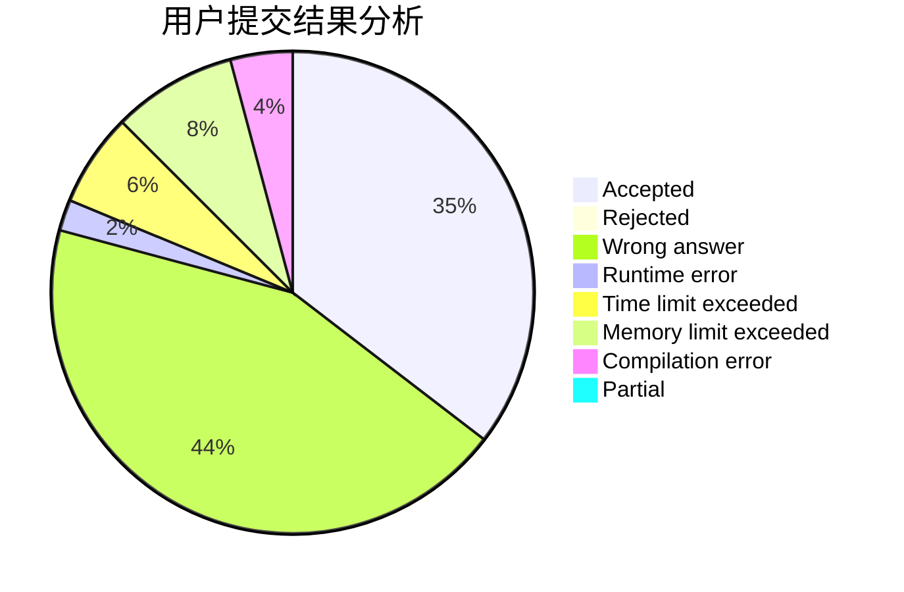
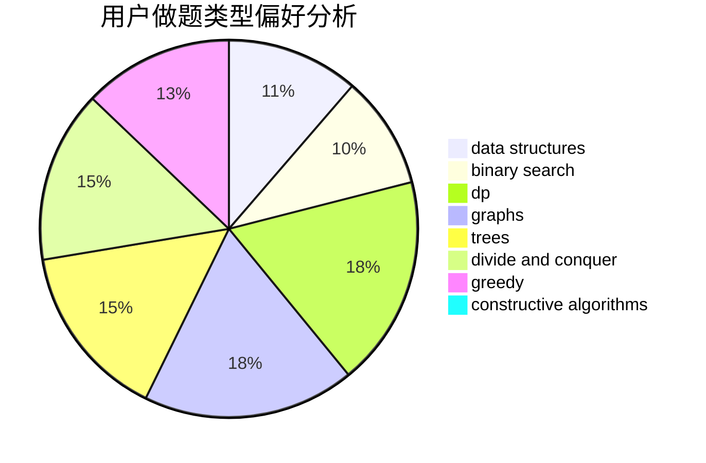
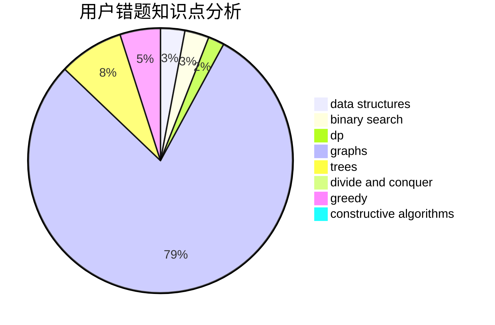

# Chiaki_Nanami

<!-- tabs:start -->

#### **用户提交结果分析**

#### **用户做题类型偏好分析**

#### **用户错题知识点分析**

<!-- tabs:end -->
# 推荐题目
[1400E](https://codeforces.com/contest/1400/problem/E)		data structures,
                        divide and conquer,
                        dp,
                        greedy		  
[1086C](https://codeforces.com/contest/1086/problem/C)		dsu,graphs,sortings,trees		  
[47B](https://codeforces.com/contest/47/problem/B)		implementation		  
[1211B](https://codeforces.com/contest/1211/problem/B)		*special problem,
                        implementation		  
[1106A](https://codeforces.com/contest/1106/problem/A)		implementation		  
[218D](https://codeforces.com/contest/218/problem/D)		dsu,graphs,sortings,trees		  
[1138F](https://codeforces.com/contest/1138/problem/F)		dsu,graphs,sortings,trees		  
[1168C](https://codeforces.com/contest/1168/problem/C)		bitmasks,
                        dp		  
[1121A](https://codeforces.com/contest/1121/problem/A)		implementation,
                        sortings		  
[212C](https://codeforces.com/contest/212/problem/C)		combinatorics,
                        dp,
                        math		  
