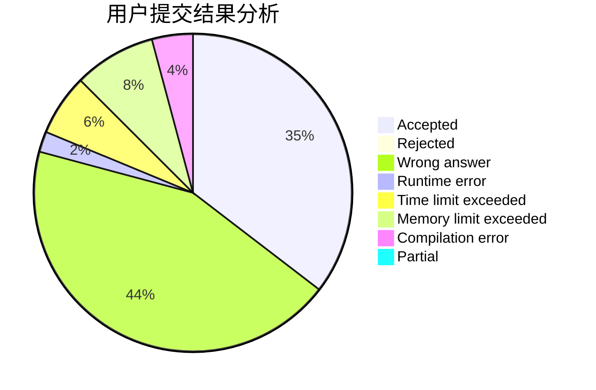
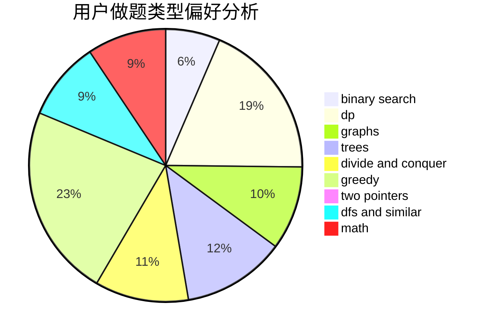

# Chiaki_Nanami

<!-- tabs:start -->

#### **用户提交结果分析**

#### **用户做题类型偏好分析**

<!-- tabs:end -->
# 推荐题目
[1400E](https://codeforces.com/contest/1400/problem/E)
[1086C](https://codeforces.com/contest/1086/problem/C)
[47B](https://codeforces.com/contest/47/problem/B)
[1211B](https://codeforces.com/contest/1211/problem/B)
[1106A](https://codeforces.com/contest/1106/problem/A)
[218D](https://codeforces.com/contest/218/problem/D)
[1138F](https://codeforces.com/contest/1138/problem/F)
[1168C](https://codeforces.com/contest/1168/problem/C)
[1121A](https://codeforces.com/contest/1121/problem/A)
[212C](https://codeforces.com/contest/212/problem/C)
