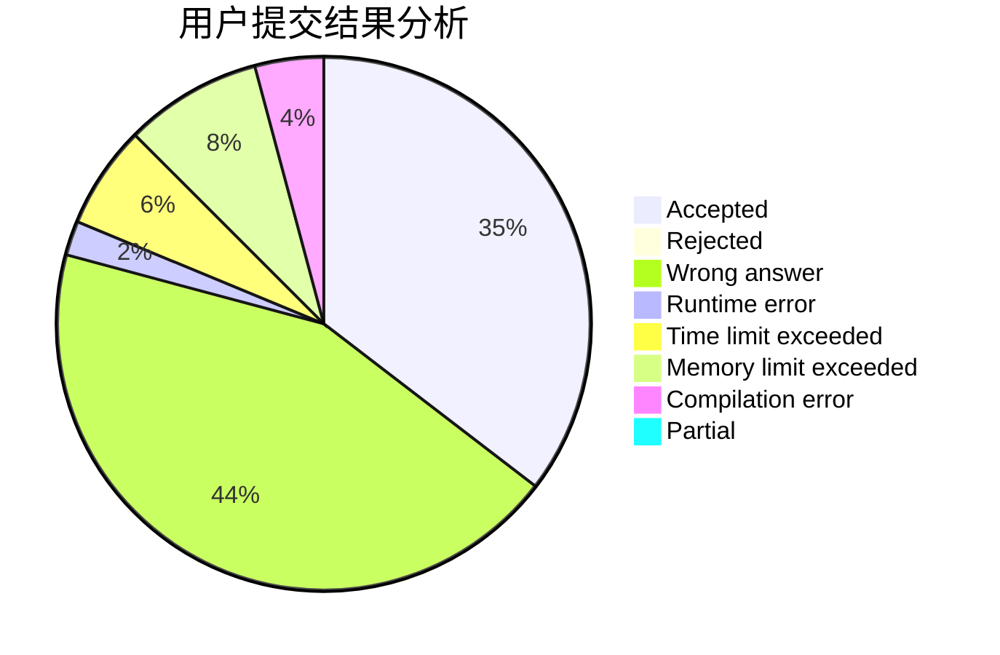
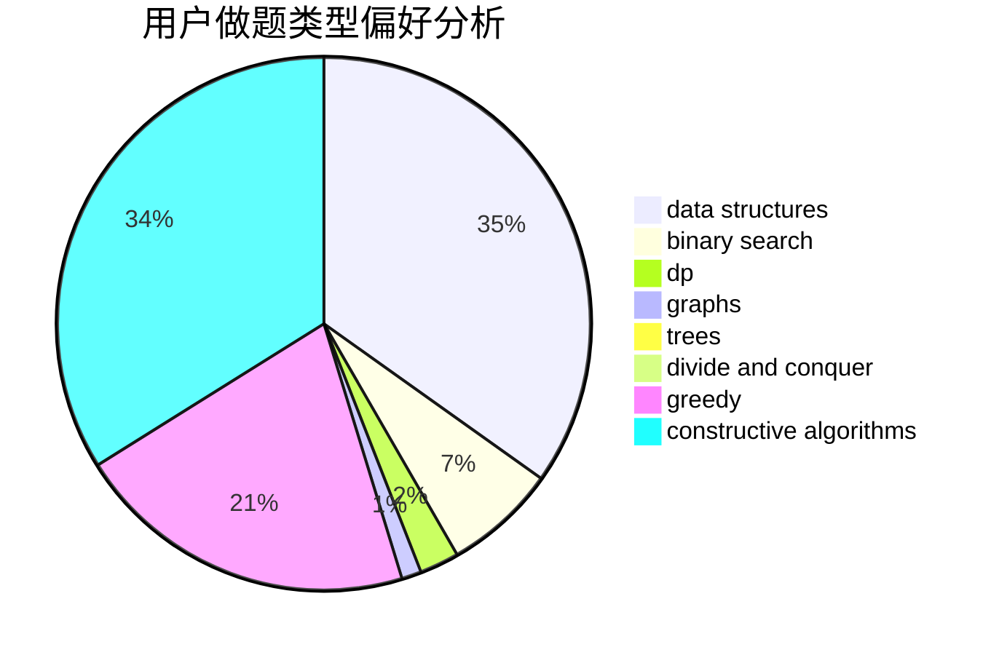
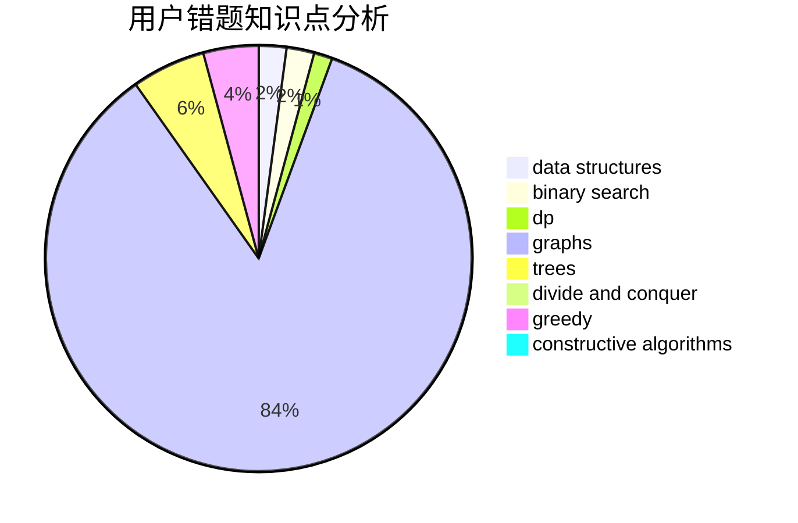

# Chiaki_Nanami

<!-- tabs:start -->

#### **用户提交结果分析**

#### **用户做题类型偏好分析**

#### **用户错题知识点分析**

<!-- tabs:end -->
# 推荐题目
[1392H](https://codeforces.com/contest/1392/problem/H)		combinatorics,
                        dp,
                        math,
                        probabilities		  
[1085G](https://codeforces.com/contest/1085/problem/G)		combinatorics,
                        data structures,
                        dp		  
[460D](https://codeforces.com/contest/460/problem/D)		brute force,
                        constructive algorithms,
                        math		  
[1207B](https://codeforces.com/contest/1207/problem/B)		constructive algorithms,
                        greedy,
                        implementation		  
[1105C](https://codeforces.com/contest/1105/problem/C)		combinatorics,
                        dp,
                        math		  
[196E](https://codeforces.com/contest/196/problem/E)		dsu,
                        graphs,
                        shortest paths		  
[1136D](https://codeforces.com/contest/1136/problem/D)		greedy		  
[1165F2](https://codeforces.com/contest/1165F/problem/2)		binary search,
                        greedy,
                        implementation		  
[1119A](https://codeforces.com/contest/1119/problem/A)		greedy,
                        implementation		  
[187C](https://codeforces.com/contest/187/problem/C)		dfs and similar,
                        dsu		  
